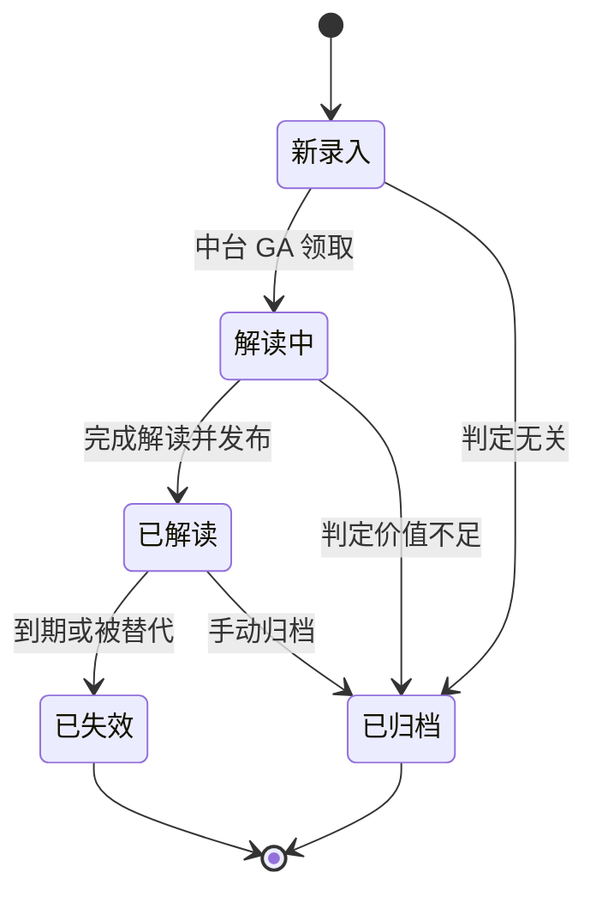
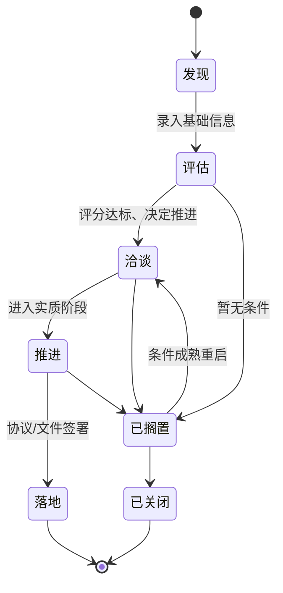
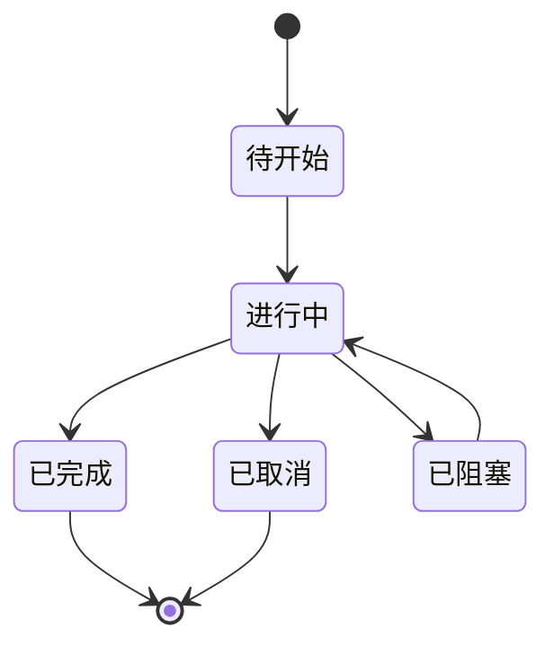
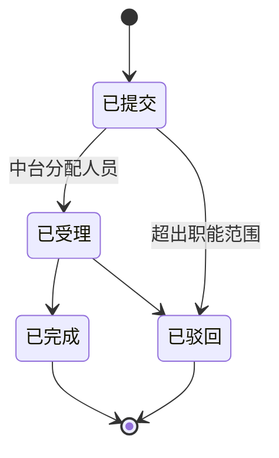

# GA 属地态势工作平台 产品需求文档(AI 主导版)

> 本文档为 GA(Government Affairs)团队内部工作平台的产品需求文档。面向公司 GA 负责人、PMO、属地 GA、中台 GA、公司决策层五类使用者,覆盖 V1.0 规划范围。
>
> 作者视角:本文档基于产品一句话定位「用热力图把属地业务态势讲清楚,给 GA 团队拓展业务的可视化指引和工具集」独立撰写,所有角色职责、功能拆解、优先级与分期均为推断,争议判断在段末以脚注形式说明。

---

## 0. 产品愿景与边界

### 0.1 产品定位

一款服务于 GA 团队的**态势感知 + 业务执行**双层工作平台。上层以中国行政区划四级(国家 / 省 / 市 / 区县)热力地图为骨架,把属地业务强度、政策密度、合作机会、关系健康度等关键信号**空间化**;下层承载属地 GA 一线的日常工作流(政策跟进、政府接触、合作项目、任务协同),并在中台和决策层之间建立向上汇报与向下指令的闭环。

### 0.2 战略背景下的产品定位

公司从「被动中台响应」转向「属地主动拓展」。产品必须同时回答两类问题:

1. **对属地一线**:我在我这个市/区应该做什么?优先级最高的事是什么?手头上的工作卡在哪里?
2. **对中台和决策层**:全国 31 个省、300+ 地级市层面,哪里是我们的重点区域?哪里有风险?哪里值得加码投入?

### 0.3 范围与边界

**在范围内:**

- 政策信息的汇聚、标签化、跟进与关联
- 政府机构与关键人关系档案
- 属地合作项目/业务机会的全生命周期管理
- 任务、会议、拜访、报告等日常协作载体
- 以行政区划四级为核心的地理可视化
- 五类角色的权限与视图分层
- 中台与属地之间的任务指派、请求响应机制

**不在范围内(V1.0 明确排除):**

- 对外客户侧门户、合作伙伴账号
- 复杂的 BI 自助分析(提供固化仪表盘即可)
- 项目财务核算、费用报销、合同管理(走公司已有系统)
- 与政府政务系统的直接对接(数据来源以内部录入 + 公开政策源为主)
- 海外 GA 业务
- OA 通用办公能力(审批流、考勤、通讯录等,走公司 IM/OA)

> AI 判断:把财务/合同/审批/通讯录全部剥离,理由是内部平台最容易陷入「什么都做一点」,必须让产品聚焦 GA 业务价值密度最高的部分;若未来与公司既有系统打通,走单点登录 + 嵌入式视图即可。

### 0.4 成功度量(顶层)

- **覆盖度**:一线属地 GA 每周活跃使用率 ≥ 80%
- **信息密度**:上线 3 个月内,累计录入政策条目 ≥ 2000 条、政府机构 ≥ 1500 家、关键人 ≥ 3000 人
- **决策赋能**:决策层每月查看热力仪表盘 ≥ 2 次,且至少一次战略讨论引用平台数据
- **响应效率**:属地发起的中台请求,平均响应时长 ≤ 48 小时

---

## 1. 用户角色与权限大纲

### 1.1 五类角色画像(独立推断)

| 角色 | 所在层级 | 典型诉求 | 主场景 |
|---|---|---|---|
| **GA 负责人** | 总部,一号位 | 看全国盘子、定方向、看一线产出、决定是否加码某个区域 | 全国热力总览、属地战报、区域投入评估 |
| **PMO** | 总部,项目管理中枢 | 保证动作落地、节奏对齐、跨区域协同、向上汇报 | 任务池、里程碑看板、周报/月报生成 |
| **属地 GA** | 驻点省/市一线 | 我的辖区里每天要跟谁、推什么政策、交付什么结果 | 属地工作台、政策日历、政府走访记录、机会管理 |
| **中台 GA** | 总部职能支持 | 为一线提供专业能力(行业政策解读、材料支持、部委协调),响应属地需求 | 政策库、请求队列、知识支持 |
| **公司决策层** | 高管/业务一把手 | 高度抽象、看大势、看风险、看重点区域 | 战略仪表盘、月度热力报告、重大事项红榜 |

### 1.2 权限模型概述

采用**角色(Role)+ 数据域(Scope)** 双维度权限。

- **Role** 决定能**操作什么**(读/写/审批/发布/管理)
- **Scope** 决定能**看到哪些数据**(全国 / 某片区 / 某省 / 某市 / 某区)

**数据域规则(Scope)**:

- GA 负责人、PMO、中台 GA、决策层:默认全国可视
- 属地 GA:默认**所辖省或市**可视;跨省协作需申请临时授权

**特殊设定**:

- 所有「机密级」政府接触记录默认仅创建者和直线主管可见,需显式共享才能扩散
- 关键人档案中的敏感字段(家庭、偏好、私人联系方式)仅 GA 负责人、属地责任人可见

> AI 判断:数据域粒度放到「省/市」两级而非「区县」,原因是属地 GA 即使驻某市,实际工作常跨市协同,过细的数据墙会妨碍一线。区县粒度仅作为标签和筛选维度,不作为权限边界。

---

## 2. 用户场景与用户故事

### 2.1 场景 A:新属地 GA 入职第一周(属地 GA 视角)

张伟新入职,派驻浙江温州。他登入平台,第一眼看到**温州市热力视图**,下钻到市辖区,看到:本市现有 18 条跟进中政策、3 个在谈合作项目、12 个核心政府关系人。他点开「待办 Top 5」,PMO 已经给他预置了几项首周任务:拜访市发改委联系人、补全两条新能源补贴政策的解读、输出一份温州本地市场摸底报告。

**用户故事**:

- 作为属地 GA,我希望登录后立刻看到「我的辖区全景」,不必手动筛选
- 作为属地 GA,我希望有一个清晰的「今日 / 本周待办」入口
- 作为属地 GA,我希望快速查看前任留下的历史接触记录和政策跟进脉络

### 2.2 场景 B:全国热力月度回顾(GA 负责人视角)

月初,GA 负责人打开「全国热力总览」,切换到「合作机会强度」维度,看到华东、华南热力最浓,西北地区出现新的红点(某省近期出台了新的新能源示范项目扶持政策,本地 GA 已登记两个机会)。他点击该省,下钻查看省-市-区三级热力分布,再点进具体机会,查看负责人、当前阶段、下一步动作。他把该省标记为「本月重点关注」,系统自动向该省属地 GA 和中台对口同事推送关注提示。

**用户故事**:

- 作为 GA 负责人,我希望通过切换热力维度(政策密度、机会金额、关系活跃度、风险指数)理解全国态势
- 作为 GA 负责人,我希望能「圈定重点区域」并让相关人员收到信号
- 作为 GA 负责人,我希望月末有一键生成的全国态势月报

### 2.3 场景 C:政策触发的属地联动(中台 GA + 属地 GA 视角)

中台 GA 小陈在政策库录入一条国家发改委新发的专项文件,系统根据政策标签(行业=新能源,层级=国家级,地理影响面=全国)自动推送给所有属地 GA,并在每个省的热力图上生成「政策影响提示」。江苏的属地 GA 小林收到推送,结合该政策撰写「本省落地可能性分析」并关联到已有的 3 个合作机会上,其中 1 个机会状态从「观望」升级为「启动洽谈」。

**用户故事**:

- 作为中台 GA,我希望录入的政策能**自动匹配**到相关属地和机会
- 作为属地 GA,我希望政策能**反向关联**到我正在跟进的项目,作为新的论据
- 作为 PMO,我希望能看到「一条政策引发了多少属地动作」的传导链

### 2.4 场景 D:决策层季度汇报(决策层视角)

季度末,决策层在手机端打开平台,进入「高管视图」,只看三张图:全国态势热力图 / Top 10 重点区域战报 / 本季度重大事项红黑榜。决策层需要一位助理都不用,5 分钟内对本季度属地 GA 全局有把握。

**用户故事**:

- 作为决策层,我只看结论、不看过程
- 作为决策层,我希望移动端体验极度简洁
- 作为决策层,我希望看到异常点(如某省 KPI 大幅波动)时有清晰归因

### 2.5 场景 E:跨区域协同(PMO 视角)

某全国性大客户在 5 省同时推进合作,PMO 在平台上建一个「跨区域战役」,把 5 省属地 GA 拉进同一个协同空间,共享进度、对齐话术、统一节点。每个属地 GA 在自己的工作台看到「我在这个战役里负责的部分」,同时不影响他本地的独立工作。

**用户故事**:

- 作为 PMO,我希望能超越地理边界组织虚拟项目组
- 作为属地 GA,我希望跨区域任务不与我的本地任务混在一起

---

## 3. 功能模块清单与优先级

以下所有功能点标注 P0(MVP 必须)/ P1(V1.0 内含)/ P2(V1.1–V1.2)/ P3(远期可选)。

### 3.1 地理可视化中枢(模块 M1)

| 功能点 | 优先级 | 说明 |
|---|---|---|
| 四级行政区划热力地图(国家/省/市/区) | P0 | 核心视觉骨架,支持下钻与返回 |
| 热力维度切换(政策密度/机会金额/关系活跃度/风险指数/综合态势) | P0 | 至少上线 3 个维度 |
| 点击行政区域查看摘要浮层 | P0 | 快速预览区域关键指标 |
| 地图上标注机会点/政府机构点 | P1 | 点图层,可筛选、可叠加 |
| 时间轴回放(过去 N 个月态势演化) | P2 | 动画展示热力演变 |
| 自定义热力维度(用户定义公式) | P3 | 高级用户 |

### 3.2 政策管理(模块 M2)

| 功能点 | 优先级 | 说明 |
|---|---|---|
| 政策条目录入与编辑(含发文机关、层级、行业、地理范围) | P0 | 核心实体 |
| 政策标签体系(多维标签:行业/主题/工具类型等) | P0 | 支持筛选和推送匹配 |
| 政策跟进状态管理(新录入/解读中/已解读/已归档等) | P0 | 状态机见 §4 |
| 政策解读附件与版本历史 | P1 | 中台 GA 主要产出 |
| 政策 → 机会/机构 的关联 | P0 | 建立政策传导链 |
| 政策影响面自动提示(规则推断,推送给属地) | P1 | 基于行政范围 + 行业标签 |
| 政策日历(按发文/生效/截止日期) | P1 | 属地 GA 高频使用 |
| 外部政策源抓取(人民网、发改委等公开源) | P3 | 远期可选,涉及合规 |

### 3.3 政府关系档案(模块 M3)

| 功能点 | 优先级 | 说明 |
|---|---|---|
| 政府机构档案(层级、隶属、地址、职能) | P0 | |
| 关键人档案(姓名、职务、所在机构、联系方式) | P0 | |
| 关键人分层(核心/重要/普通) | P1 | 分层推动资源倾斜 |
| 关系活跃度评分(基于接触频次、最近一次接触) | P1 | 作为热力维度之一 |
| 接触记录(会见/电话/会议/活动参与) | P0 | 属地 GA 日常录入 |
| 机构间上下级关系图谱 | P2 | 可视化关系网 |
| 人员岗位变动跟踪 | P2 | 提示「张处长调任至 XX」 |

### 3.4 机会与项目管理(模块 M4)

| 功能点 | 优先级 | 说明 |
|---|---|---|
| 机会录入(所在地、类型、金额范围、关联机构/政策) | P0 | |
| 机会阶段管理(发现/评估/洽谈/推进/落地/归档) | P0 | 状态机见 §4 |
| 机会负责人指派 | P0 | |
| 机会地图展示(按所在地聚合) | P0 | 与 M1 联动 |
| 机会评分(规则:金额 × 把握度 × 战略相关度) | P1 | 用于热力和优先级 |
| 跨区域战役组(虚拟项目组) | P1 | 场景 E |
| 机会文档/材料归档 | P2 | |
| 机会复盘模板 | P2 | |

### 3.5 任务与协同(模块 M5)

| 功能点 | 优先级 | 说明 |
|---|---|---|
| 任务创建与指派 | P0 | 基础协同载体 |
| 任务关联到政策/机会/机构 | P0 | 保证任务不孤立 |
| 我的待办看板 | P0 | 属地 GA 入口 |
| 中台支援请求(属地 → 中台) | P0 | 请求队列 |
| 任务提醒与逾期告警 | P1 | |
| 审批流(简单二级) | P2 | 例如重要接触申请 |
| IM 通知集成 | P2 | 与公司 IM 对接 |

### 3.6 分析与报表(模块 M6)

| 功能点 | 优先级 | 说明 |
|---|---|---|
| 属地工作台统计卡片 | P0 | 每日/每周指标 |
| 全国态势仪表盘 | P0 | GA 负责人主屏 |
| 高管视图(决策层极简版) | P0 | 三张核心图 |
| 月度/季度报告一键生成(PDF/PPT) | P1 | PMO 核心诉求 |
| 异动告警(热力大幅变化) | P2 | |
| 自定义报表 | P3 | |

### 3.7 系统管理(模块 M7)

| 功能点 | 优先级 | 说明 |
|---|---|---|
| 组织架构与角色分配 | P0 | |
| 数据域分配(辖区) | P0 | |
| 操作审计日志 | P1 | 合规需要 |
| 字典管理(标签、状态、分级) | P1 | |
| 外部接口管理 | P3 | |

### 3.8 MVP 范围(P0 总览)

MVP 要解决的最小闭环:**属地 GA 能在平台上记录工作、中台 GA 能提供政策与支援、GA 负责人能看到全国态势、决策层能看到简化总览、PMO 能串联任务。**

P0 功能合计:M1(基础地图 + 热力 + 下钻 + 摘要)、M2(政策录入 + 标签 + 状态 + 关联)、M3(机构、关键人、接触记录)、M4(机会录入 + 阶段 + 指派 + 地图)、M5(任务创建 + 关联 + 待办 + 支援请求)、M6(三类主仪表盘)、M7(角色 + 数据域)。

> AI 判断:MVP 刻意不纳入「外部政策抓取」「关系图谱可视化」「时间轴回放」这些视觉吸引力高但落地难的能力。MVP 的核心矛盾是**一线有没有意愿每天打开平台录数据**,没有录入就没有热力,视觉做得再炫也是空壳。

---

## 4. 核心数据模型

### 4.1 实体清单

| 实体 | 英文名 | 说明 |
|---|---|---|
| 用户 | User | 系统使用者 |
| 组织 | Org | 内部组织结构 |
| 行政区划 | Region | 国家/省/市/区四级 |
| 政府机构 | GovOrg | 政府部门/机关 |
| 关键人 | GovContact | 政府端关键联系人 |
| 政策 | Policy | 政策条目 |
| 政策标签 | PolicyTag | 多维标签 |
| 合作机会 | Opportunity | 业务机会/项目 |
| 战役 | Campaign | 跨区域虚拟项目组 |
| 接触记录 | Engagement | 会见/电话/会议/活动 |
| 任务 | Task | 工作任务 |
| 支援请求 | SupportRequest | 属地向中台的请求 |
| 评论 | Comment | 挂在各实体下的讨论 |
| 附件 | Attachment | 文档/图片 |

### 4.2 字段定义(关键实体)

#### 4.2.1 Region(行政区划)

| 字段 | 类型 | 必填 | 含义 | 示例 |
|---|---|---|---|---|
| region_id | string | 是 | 唯一编码(国家统计局编码) | 330300 |
| name | string | 是 | 名称 | 温州市 |
| level | enum | 是 | 级别:country/province/city/district | city |
| parent_id | string | 否 | 上级编码 | 330000 |
| geo_boundary | geojson | 否 | 边界多边形 | - |
| centroid | geo_point | 是 | 中心点坐标 | (120.65, 28.00) |

#### 4.2.2 GovOrg(政府机构)

| 字段 | 类型 | 必填 | 含义 | 示例 |
|---|---|---|---|---|
| org_id | string | 是 | 主键 | G-20260001 |
| name | string | 是 | 机构全称 | 温州市发展和改革委员会 |
| short_name | string | 否 | 简称 | 温州发改委 |
| region_id | string | 是 | 所在行政区划 | 330300 |
| level | enum | 是 | 国家级/省级/市级/区县级 | 市级 |
| parent_org_id | string | 否 | 上级机构 | - |
| function_tags | string[] | 否 | 职能标签 | ["能源","发改"] |
| address | string | 否 | 办公地址 | - |
| established_by | user_id | 是 | 建档人 | - |
| created_at | datetime | 是 | 建档时间 | - |

#### 4.2.3 GovContact(关键人)

| 字段 | 类型 | 必填 | 含义 | 示例 |
|---|---|---|---|---|
| contact_id | string | 是 | 主键 | C-20260001 |
| name | string | 是 | 姓名 | 张 XX |
| gender | enum | 否 | 性别 | 男 |
| org_id | string | 是 | 所在机构 | G-20260001 |
| title | string | 是 | 职务 | 副主任 |
| tier | enum | 否 | 分层:核心/重要/普通 | 核心 |
| phone | string | 否 | 电话(敏感字段) | - |
| wechat | string | 否 | 微信(敏感字段) | - |
| preference_notes | text | 否 | 偏好备注(敏感字段) | - |
| owner_user_id | user_id | 是 | 责任人 | - |
| last_engaged_at | datetime | 否 | 上次接触时间 | - |
| activity_score | number | 否 | 系统计算的活跃度 | 72 |

#### 4.2.4 Policy(政策)

| 字段 | 类型 | 必填 | 含义 | 示例 |
|---|---|---|---|---|
| policy_id | string | 是 | 主键 | P-20260001 |
| title | string | 是 | 标题 | 关于推进 XX 的通知 |
| doc_no | string | 否 | 文号 | 发改能源〔2026〕1 号 |
| issued_by | string | 是 | 发文机关 | 国家发改委 |
| issued_level | enum | 是 | 国家/省/市/区 | 国家 |
| issued_at | date | 是 | 发文日期 | 2026-03-15 |
| effective_at | date | 否 | 生效日期 | 2026-04-01 |
| expires_at | date | 否 | 失效日期 | - |
| geo_scope | region_id[] | 是 | 影响地理范围 | [全国] |
| industry_tags | string[] | 是 | 行业标签 | ["新能源","储能"] |
| topic_tags | string[] | 否 | 主题标签 | ["补贴","试点"] |
| instrument_type | enum | 否 | 工具类型:补贴/规划/许可/规范/其他 | 补贴 |
| source_url | url | 否 | 原文链接 | - |
| attachments | attachment_id[] | 否 | 附件 | - |
| interpretation | text | 否 | 解读正文 | - |
| interpreter | user_id | 否 | 解读人(中台 GA) | - |
| status | enum | 是 | 见状态机 | 解读中 |
| created_by | user_id | 是 | 录入人 | - |

#### 4.2.5 Opportunity(合作机会)

| 字段 | 类型 | 必填 | 含义 | 示例 |
|---|---|---|---|---|
| opp_id | string | 是 | 主键 | O-20260001 |
| title | string | 是 | 机会标题 | 温州 XX 光伏合作 |
| region_id | string | 是 | 主要所在地 | 330300 |
| type | enum | 是 | 合作类型:项目落地/政策申请/示范合作/其他 | 项目落地 |
| estimated_value | number | 否 | 预估金额(万元) | 5000 |
| win_probability | enum | 否 | 把握度:低/中/高 | 中 |
| strategic_level | enum | 否 | 战略相关度:低/中/高 | 高 |
| stage | enum | 是 | 见状态机 | 洽谈 |
| owner_user_id | user_id | 是 | 主负责人 | - |
| co_owner_ids | user_id[] | 否 | 协同人 | - |
| related_gov_org_ids | string[] | 否 | 关联机构 | - |
| related_policy_ids | string[] | 否 | 关联政策 | - |
| campaign_id | string | 否 | 所属战役 | - |
| next_action | string | 否 | 下一步动作 | - |
| next_action_at | date | 否 | 下一步动作时间 | - |
| score | number | 否 | 机会综合评分 | 76 |
| created_at | datetime | 是 | 创建时间 | - |
| closed_at | datetime | 否 | 关闭时间 | - |

#### 4.2.6 Engagement(接触记录)

| 字段 | 类型 | 必填 | 含义 | 示例 |
|---|---|---|---|---|
| eng_id | string | 是 | 主键 | E-20260001 |
| type | enum | 是 | 拜访/电话/会议/活动/其他 | 拜访 |
| occurred_at | datetime | 是 | 发生时间 | - |
| region_id | string | 是 | 发生地 | 330300 |
| gov_org_id | string | 否 | 关联机构 | - |
| contact_ids | contact_id[] | 否 | 到场关键人 | - |
| our_attendees | user_id[] | 是 | 我方参与人 | - |
| summary | text | 是 | 简述 | - |
| outcome | text | 否 | 结论/产出 | - |
| sensitivity | enum | 是 | 默认/机密 | 默认 |
| related_opp_ids | string[] | 否 | 关联机会 | - |
| related_policy_ids | string[] | 否 | 关联政策 | - |

#### 4.2.7 Task(任务)

| 字段 | 类型 | 必填 | 含义 | 示例 |
|---|---|---|---|---|
| task_id | string | 是 | 主键 | T-20260001 |
| title | string | 是 | 标题 | 完成温州市场摸底 |
| description | text | 否 | 描述 | - |
| assignee_id | user_id | 是 | 承接人 | - |
| creator_id | user_id | 是 | 创建人 | - |
| due_at | datetime | 否 | 截止时间 | - |
| priority | enum | 否 | 低/中/高/紧急 | 高 |
| status | enum | 是 | 见状态机 | 进行中 |
| link_type | enum | 否 | 关联实体类型 | opp |
| link_id | string | 否 | 关联实体 id | O-20260001 |

#### 4.2.8 SupportRequest(支援请求)

| 字段 | 类型 | 必填 | 含义 | 示例 |
|---|---|---|---|---|
| req_id | string | 是 | 主键 | R-20260001 |
| requester_id | user_id | 是 | 发起属地 GA | - |
| topic | enum | 是 | 政策解读/材料支持/部委协调/其他 | 政策解读 |
| description | text | 是 | 说明 | - |
| urgency | enum | 是 | 低/中/高 | 高 |
| desired_deadline | date | 否 | 期望完成时间 | - |
| assigned_to | user_id | 否 | 中台承接人 | - |
| status | enum | 是 | 见状态机 | 已受理 |
| created_at | datetime | 是 | 发起时间 | - |

### 4.3 实体关系(文字描述)

- Region 是所有空间属性的锚点,GovOrg / Opportunity / Engagement / Policy.geo_scope 均指向 Region
- GovOrg 1-N GovContact
- Opportunity N-N Policy(通过 related_policy_ids)
- Opportunity N-N GovOrg
- Opportunity 0-1 Campaign
- Task 0-1 {Policy | Opportunity | GovOrg | GovContact | Engagement}(多态外键)
- Engagement N-N {Policy, Opportunity, GovContact}

### 4.4 关键状态机

#### 4.4.1 Policy 状态机



#### 4.4.2 Opportunity 状态机



#### 4.4.3 Task 状态机



#### 4.4.4 SupportRequest 状态机



---

## 5. 权限矩阵

以下矩阵使用缩写:R=读、W=写(创建/编辑)、D=删除、A=审批/发布、M=管理(包含角色分配等)。空白表示无权限。

### 5.1 实体级权限矩阵

| 实体 / 角色 | GA 负责人 | PMO | 属地 GA | 中台 GA | 决策层 |
|---|---|---|---|---|---|
| Region(只读字典) | R | R | R | R | R |
| GovOrg | R/W/D | R/W | R/W(本辖区) | R | R |
| GovContact(非敏感字段) | R/W | R | R/W(本辖区) | R | R |
| GovContact(敏感字段) | R | — | R/W(自己是 owner 时) | — | — |
| Policy | R/W/A | R | R/W(解读下沉) | R/W/A | R |
| PolicyTag 字典 | R/M | R | R | R | R |
| Opportunity | R/W | R/W | R/W(本辖区或自己负责) | R | R |
| Campaign | R/W/A | R/W/A | R(参与时) | R | R |
| Engagement | R | R | R/W(自己的+本辖区非机密) | R(本人受邀) | — |
| Engagement(机密) | R(全量) | — | R/W(owner + 直线主管) | — | — |
| Task | R/W | R/W | R/W(与我相关) | R/W(与我相关) | — |
| SupportRequest | R | R | R/W(自己发起) | R/W(分配给自己) | — |
| 仪表盘:属地工作台 | R | R | R(本辖区) | — | — |
| 仪表盘:全国态势 | R | R | — | R | — |
| 仪表盘:高管视图 | R | R | — | — | R |
| 操作审计日志 | R | R | — | — | — |
| 系统管理 | M | — | — | — | — |

### 5.2 关键权限规则说明

1. **属地 GA 的写权限受数据域约束**:默认只能写「本省/本市」数据;跨辖区写需临时授权(有审计)
2. **机密接触记录**仅对 owner、owner 的直线主管、GA 负责人可见;显式共享后扩展至指定人
3. **Policy 的发布权**在中台 GA 与 GA 负责人之间分层:国家级和省级政策的解读发布需 GA 负责人/中台主管 A
4. **决策层**是「只读 + 极简视图」角色,不参与任何录入和操作,降低误操作风险
5. **PMO** 拥有跨域写权限(任务、战役、报表),但不拥有关系档案的敏感字段

> AI 判断:PMO 不给敏感字段访问权,理由是其定位是「推进项目」而非「维护关系」,把关系档案的敏感数据锁在业务责任人手上,能避免 PMO 过度干预一线关系经营。这个决策可能有争议。

---

## 6. 信息架构与关键流程

### 6.1 一级导航结构(按角色呈现差异)

**属地 GA 默认导航**:

1. 我的工作台(首页)
2. 本辖区热力地图
3. 机会
4. 关系档案
5. 政策库
6. 任务
7. 支援请求

**中台 GA 默认导航**:

1. 我的工作台
2. 政策库(主工作区)
3. 支援请求队列
4. 全国态势
5. 关系档案(全量)

**GA 负责人默认导航**:

1. 全国态势(首页)
2. 重点区域
3. 政策库
4. 机会
5. 战役
6. 团队

**PMO 默认导航**:

1. 战役
2. 任务池
3. 全国态势
4. 报表中心

**决策层默认导航**(移动端优先):

1. 态势总览(首页,一张图)
2. 重点区域
3. 月度/季度报告

### 6.2 关键流程

#### 6.2.1 政策录入 → 属地触达流程

```
中台 GA 录入政策
  ↓
系统按 geo_scope + industry_tags 匹配属地 GA 与相关机会
  ↓
生成「政策影响提示」推送到目标属地工作台
  ↓
属地 GA 查看 → 决定是否关联本地机会 / 补充本地解读
  ↓
被关联的机会自动在动态轴记录一条事件
  ↓
PMO 在报表中看到传导链
```

#### 6.2.2 属地发起支援请求流程

```
属地 GA 提交 SupportRequest(选主题 + 紧急度)
  ↓
中台负责人在「请求队列」看到新请求
  ↓
中台负责人分配承接人 → 状态变更为「已受理」
  ↓
承接中台 GA 处理 → 产出解读/材料 → 附件上传
  ↓
状态变更为「已完成」→ 通知属地
  ↓
属地 GA 确认,若不满意可重开
```

#### 6.2.3 机会推进关键节点

```
发现(录入基础信息)
  ↓
评估(补齐金额/把握度/战略相关度 → 系统计算评分)
  ↓
洽谈(开始定期接触,产出 Engagement)
  ↓
推进(阶段性成果,如备忘录、意向书)
  ↓
落地(协议/项目启动)
  ↓(并行)
过程中任一节点可发起 SupportRequest、关联 Policy、拉入 Campaign
```

#### 6.2.4 热力计算流程(后台,每日 T+1)

```
拉取当日各 Region 下实体计数与指标:
  - 政策密度:近 90 天 Policy 落 geo_scope 的数量
  - 机会金额:本 Region 下「评估/洽谈/推进」状态 Opportunity 的 estimated_value 加权和
  - 关系活跃度:本 Region 下 GovContact 的 activity_score 均值
  - 风险指数:逾期任务数 + 已搁置机会数等综合
  ↓
标准化到 [0, 100]
  ↓
写入 Region 的 daily_metrics 表
  ↓
前端按用户切换的维度从该表读取
```

### 6.3 信息架构图(文字)

```
顶层:五类角色 → 差异化首页
    ↓
二级:地图视图 / 列表视图 / 看板视图(同一批数据三态切换)
    ↓
三级:实体详情页(政策、机构、关键人、机会、战役、任务)
    ↓
四级:实体关联面板(关联的其他实体、动态、评论、附件)
```

---

## 7. 非功能需求

### 7.1 性能

- 热力地图首屏 ≤ 2 秒,下钻切换 ≤ 500ms
- 实体详情页 ≤ 1 秒
- 批量导入(政策/机构/关键人,单次 500 条)≤ 10 秒

### 7.2 可用性

- 工作时段(9:00-19:00)可用性 ≥ 99.9%
- 单次变更灰度发布,失败可 5 分钟内回滚

### 7.3 安全与合规

- 公司 SSO 登录,不支持独立密码
- 所有操作留审计日志,保留 3 年
- 敏感字段(联系方式、机密记录)按字段级权限控制,前端不下发无权限字段
- 数据按规定全部存放于公司私有云/合规机房
- 不对公网暴露,仅内网与公司 VPN 可访问

### 7.4 兼容性

- PC 端:Chrome / Edge 最新两个大版本,屏幕宽度 ≥ 1280
- 移动端:iOS 15+、Android 10+(决策层极简视图优先,属地 GA 次之)
- 不支持 IE

### 7.5 国际化

- 仅中文(简体)

### 7.6 可观测性

- 核心页面前端性能埋点
- 关键业务事件埋点:政策录入、机会晋级、支援请求完成、接触记录创建

### 7.7 离线与弱网

- 属地 GA 常在政府大楼走访,弱网场景需支持:接触记录本地暂存,联网后自动同步(P1)

> AI 判断:弱网草稿保存列到 P1 而非 P0,是因为 MVP 更紧迫的问题是先让一线愿意录入数据,弱网优化可在一线反馈中迭代补上。

---

## 8. 外部依赖与未决项

### 8.1 外部依赖

| 依赖 | 说明 | 影响 |
|---|---|---|
| 公司 SSO | 用户登录 | 强依赖,缺失则无法上线 |
| 公司 IM | 消息通知 | 中等依赖,缺失降级为站内信 |
| 公司 OA / HR | 组织架构同步 | 中等依赖,缺失则手动维护 |
| 地图底图数据 | 国内合规地图服务 | 强依赖,需采购 |
| 行政区划边界与编码 | 权威数据源 | 强依赖,可一次性导入 |
| 公司私有云 | 托管环境 | 强依赖 |
| 企业邮箱 | 报告分发 | 弱依赖 |

### 8.2 未决项(本文档内已做判断,但产品方可能需再讨论)

1. **属地 GA 数据域粒度到「市」还是「省」** ——本 PRD 判断为「省或市二选一,按实际驻点」,需产品方确认是否合理
2. **机密接触记录的默认可见范围是否含 PMO** ——本 PRD 判断不含
3. **政策解读发布是否需要审批** ——本 PRD 判断国家级/省级需 GA 负责人审批,市级及以下由中台 GA 直接发布
4. **热力维度的默认排序与初始选项** ——本 PRD 上线默认「综合态势」
5. **移动端覆盖范围** ——本 PRD 判断 V1.0 仅决策层视图,属地 GA 移动端进 V1.1
6. **外部政策自动抓取** ——本 PRD 判断不做,手工录入为主

---

## 9. 里程碑与分期

### 9.1 分期总览

| 版本 | 目标 | 时长(估算) | 主要内容 |
|---|---|---|---|
| V0.1 内测 | 骨架可用 | 4 周 | 地图 + 政策/机会/机构/关键人基础录入 + 角色权限 |
| V0.5 试点 | 选 2-3 省真实使用 | 6 周 | 接触记录、任务、支援请求、属地工作台 |
| V1.0 GA | 全量铺开 | 6 周 | 全国态势仪表盘、高管视图、月报生成、数据域完善 |
| V1.1 | 移动端 + 弱网 | 4 周 | 属地 GA 移动端、离线草稿 |
| V1.2 | 深度分析 | 6 周 | 异动告警、时间轴回放、关系图谱 |
| V2.0 | 生态拓展 | 评估后规划 | 外部政策抓取、跨系统集成、更多分析能力 |

### 9.2 V0.1 内测验收标准

- 5 类角色均能登录,看到差异化首页
- 能录入 50 条政策、100 个机构、200 个关键人、20 个机会
- 地图能按「政策密度」维度渲染热力并下钻
- 权限隔离可见(属地 A 看不到属地 B 的机会)

### 9.3 V0.5 试点验收标准

- 试点区域一线 GA 每周活跃 ≥ 80%
- 接触记录周录入 ≥ 20 条/人
- 支援请求闭环时长 ≤ 72 小时
- 属地工作台加载 ≤ 2 秒

### 9.4 V1.0 GA 验收标准

- 所有属地 GA 均开通且至少周活 1 次
- 决策层月度查看高管视图 ≥ 2 次
- 月报一键生成可用于正式汇报场合
- 全量数据下热力图渲染 ≤ 2 秒

---

## 10. 术语表

| 术语 | 解释 |
|---|---|
| GA | Government Affairs,政府事务 |
| 属地 GA | 驻点各省/市的一线 GA 人员 |
| 中台 GA | 总部职能支持的 GA 人员,提供政策解读、材料、部委协调等专业能力 |
| PMO | Project Management Office,项目管理办公室,负责节奏与跨部门协同 |
| 辖区 / 数据域 | 一个属地 GA 负责的行政区域范围 |
| 热力图 | 基于行政区划边界,以颜色深浅表达某维度指标强弱的可视化图 |
| 下钻 | 从省 → 市 → 区县逐级查看更细数据 |
| 机会 | 合作机会,一个待推进/推进中的具体业务可能性 |
| 战役 | 跨区域组合而成的虚拟项目组,用于组织全国性协同行动 |
| 关键人 | 政府端与我方工作密切相关的核心联系人 |
| 接触记录 | 我方与政府端发生的一次拜访、电话、会议或活动的记录 |
| 支援请求 | 属地 GA 发起、由中台 GA 承接的专业支持请求 |
| 影响面 | 一条政策在地理与行业维度上覆盖的范围 |
| 传导链 | 从政策 → 机会 → 行动的业务触发路径 |

---

## 附录:作者最不确定的 5 个判断点

以下是本文档中 AI 独立判断时最没把握、最希望产品方对比验证的 5 处:

1. **「PMO」的定位究竟是什么** ——本文档把 PMO 定位为「项目管理中枢」,负责任务池、战役、报表生成。但在一个从中台向属地转型的 GA 团队里,PMO 也可能是战略规划角色,或者只是负责人的助理。如果 PMO 的真实定位不同,权限矩阵、战役与任务的归属都需要调整。

2. **属地 GA 的数据域粒度(省 vs 市)** ——本文档判断数据域以「省或市」为单位,具体看驻点深度;但如果公司的驻点策略是「每省一人」或「每市一人」,粒度应相应调整。这直接决定了「跨域协作」的频度和设计重心。

3. **「机密接触记录」这个概念是否真的存在** ——本文档假设存在一类敏感的政府接触(涉及未公开信息、内部人脉等)需要字段级保护。但有些公司完全不在 IT 系统里记录敏感接触,只口头传递。若后者,「敏感字段 + 机密标记」的整套设计就是过度设计。

4. **决策层到底看不看这个系统** ——本文档假设决策层愿意自己打开系统看「高管视图」。但现实中高管常用的是「PMO 每周塞进邮箱的 PPT」,自主使用率可能极低。若判断失误,应把「月报/季报一键生成」拔高到 P0,而不是高管视图本身。

5. **热力图「以什么为默认维度」** ——本文档选择「综合态势」作为默认,但综合态势需要一个加权公式,这个公式从哪里来?如果用户对默认维度不买账,首屏就会失败。更保守的做法或许是让首屏直接呈现「政策密度」这个客观维度,留用户自己切换到业务维度,这样不带主观加权,信任成本更低。这个分歧值得对比产品方的判断。
