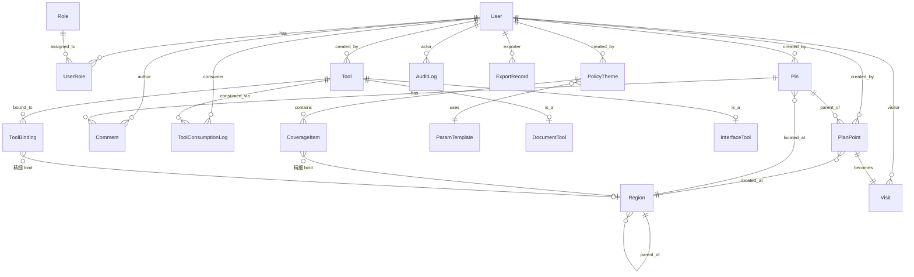

# 政策 One Piece · 用户主导版 PRD

> **本文件性质**:用户主导版 PRD,逐项由用户审核拍板,AI 仅当导航与誊写。
> **配套文件**:`docs/dual-prd-protocol.md`(双轨规则)、`docs/PRD-ai-brief.md`(AI 主导版输入)、未来产出 `docs/PRD-ai-led.md`、`docs/PRD-comparison.md`、`docs/PRD.md`(整合终稿)。
> **进度**:第 0 章已定稿(2026-04-22);第 1 章已定稿(2026-04-22 跨章 review + **2026-04-23 属地 GA 权限基线再修订:不按行政区划硬隔离**);正在推进第 2 章。

---

## 第 0 章 · 产品愿景与边界

### 0.1 产品名

| 项 | 名称 |
|---|---|
| 对外正式名 | **属地政策大地图** |
| 内部代号 | **POP**(Policy One Piece) |

### 0.2 一句话产品定位

**用热力图把属地业务态势讲清楚,给 GA 团队拓展业务的可视化指引和工具集。**

### 0.3 服务对象(5 类角色)

| # | 角色 | 关键备注 |
|---|---|---|
| 1 | **GA 负责人** | 与 PMO **权限等同**(同一权限组);偏战略/对外;**对公司高层(决策层)汇报由负责人在线下完成,决策层不直接使用本系统** |
| 2 | **PMO** | 老板意志落地;偏执行/节奏调度 |
| 3 | **属地 GA** | 一线;在各省市开展拜访、上报、政策对接;**不按行政区划硬隔离**(主责由组织流程/OKR 决定,不由系统强制) |
| 4 | **中台 GA** | 政策主题维护 + 工具(成品文档 / 调用接口)供应给一线 |
| 5 | **系统管理员** | 技术性角色;仅做账号/权限/数据维护,不参与业务 |

> **战略背景**:GA 团队历史只有"中台"角色被动处理地方事务。公司近期战略调整为对地方关系实质性拓展,新建"属地一线"驻点,本产品诞生于这个组织转型期。
> **关于"决策层"**:公司高层关心 GA 战略进展,但**不直接使用本系统**;由 GA 负责人通过线下汇报、导出截图等方式服务他们。本 PRD 不把决策层列为系统角色。

### 0.4 核心价值主张(4 条)

1. **打破信息分散** —— GA 负责人不再依赖 PPT 汇总和口头汇报,实时看到属地真相;一线和中台共享同一份"事实底图"(决策层服务由负责人线下完成)。
2. **中台产出以"一线消费"为准绳,而不是"产出量"** —— 系统不奖励"做了什么文件发给了张三",只承认"被一线引用、使用、转化的实质能力"。
3. **GA 团队是公司属地业务的双向神经末梢** —— 往外执行(拓展)、往内回流(情报);PMO 管节奏、一线属地录入与上报、中台供应工具、负责人对外汇报。
4. **双大盘:行动入口 vs 方向入口** —— **属地行动大盘**(任务驱动,服务一线 GA + PMO,告诉他们"该去哪、做什么、风险在哪")与**政策方向大盘**(信息探索,服务中台 GA + 负责人,帮他们"看懂战略机会、研判大势")**两套入口、两种设计哲学,不混淆**。

### 0.5 成功信号(三层结构,非传统单一北极星)

> **设计取向**:本产品**不设单一北极星指标**,因为目的是"让工作流转起来 + 分工清晰可见",不是"指标驱动绩效"。

#### 进展信号(三轨 · 季度/半年看是否变好)

| 轨 | 服务谁 | 看什么 |
|---|---|---|
| ① **拓展** | 负责人 / PMO | 属地 GA 新建立的本地关系数 / 政策对接进展 |
| ② **支撑** | 负责人 / PMO | 中台产出被一线消费率(被引用/使用次数) |
| ③ **情报回流** | 负责人 | 一线传回的有价值信息条数(政策动向 / 机会线索 / 风险预警) |

#### 周观测(全员看 · 周维度)

同一组数据的两面,统一呈现:

- **正向产出**:本周新增拜访 / 政策覆盖 / 工具(给全员看"在动")
- **负向预警**:本周掉队的属地 GA / 长期未更新的政策模块(给 PMO 巡视用)

> 具体度量字段、信号阈值留到第 4 章数据模型时定义。

### 0.6 使用环境

| 项 | 决定 |
|---|---|
| **主端** | PC 浏览器(在线,内网为主) |
| **副端** | **响应式 H5**(移动浏览器 / 微信内打开),只做轻量场景 |
| **移动端范围** | 快速拜访录入 + 推送通知/周观测查看 + 图钉留言 |
| **MVP 是否包含移动端** | ✅ 包含响应式 H5(轻录入 + 查看) |
| **不做** | 原生 App / 原生小程序 / 离线模式 |

### 0.7 不做什么(防范围蔓延)

#### 业务边界

1. ❌ 对外政策门户(只对内,不做对外发布)
2. ❌ 政策原文档案库(只存关键摘要,原文走外部知识库)
3. ❌ GA 绩效 OKR(不做考核工具)
4. ❌ 财务差旅报销(不做财务流程)
5. ❌ 客户 CRM(GA 对接政府,不是 to-B 销售)
6. ❌ 即时通讯(不做聊天工具)

#### 技术边界

7. ❌ 原生 App / 原生小程序(只走响应式 H5)
8. ❌ 离线模式(始终联网)

#### 产品形态边界

9. ❌ **自助 BI / 自定义报表配置**(只提供产品方设计好的固定报表,有新需求走需求评审,不做拖拽配置引擎)
10. ❌ **工作流引擎 / 审批流**(不做"中台 → 一线"的任务分派与审批,呼应 0.4 ②:系统不衡量文件流转)

#### 外部系统边界

11. ❌ **政府投诉记录数据库**(由外部系统承担;本产品仅消费其分发后的风险信息)
12. ❌ **数据分析平台 / 监管数据建模**(由外部系统承担;本产品仅展示分析结论)

### 0.8 当前阶段 + MVP 验收标准

**当前阶段**:**PRD → MVP 立项**

**MVP 验收线**(必须同时达成):

| 类别 | 验收线 |
|---|---|
| **行为(一线)** | 5+ 名属地 GA 真实使用,持续录入 ≥ 1 个月 |
| **行为(中台)** | 至少 **3** 个工具上架(成品文档或调用接口),且被一线消费(下载 + 调用合计)≥ 10 次(呼应 0.4 ②) |
| **行为(情报回流)** | 至少 **10** 条有价值信息条目录入 |
| **可视化能力** | PMO 能看周观测(产出 + 掉队预警);**负责人能看双大盘 + 三轨进展信号** |
| **跨端** | 移动端 H5 至少有 1 名属地 GA 用过(轻录入) |

---

## 第 1 章 · 用户角色与权限大纲

### 1.1 GA 负责人

| 项 | 内容 |
|---|---|
| **背景** | 公司 GA 体系最高负责人,直接向公司高层(决策层)汇报。今天面对的核心变化:GA 团队从"中台救火队"转型为"中台 + 属地一线"双线作战 |
| **日常** | (a) 与公司高层对齐 GA 战略 (b) 拍板属地一线的目标和资源投入 (c) **支持属地 GA 拜访政府高层**(战略级关系亲自出面) (d) 复盘 GA 团队整体进展、对决策层做线下汇报 |
| **核心诉求** | 不再被动等 PMO 月度汇报、不再靠 PPT 补全态势 —— 实时看清"全国 GA 在动什么、动得怎样、有什么风险";为线下汇报决策层提供口径与素材 |
| **进系统第一眼想看** | **政策方向大盘**(主)+ 本周关键事件流 + 可下钻到属地行动大盘 |
| **关系** | 与 PMO 权限等同(0.3 已定);**默认由 PMO 操盘日常节奏,负责人聚焦战略与对外**;对决策层负责(线下汇报) |
| **粗粒度权限** | 全部数据可读;**只能编辑自己创建的内容**;不参与中台政策维护(归中台 GA) |

### 1.2 PMO

| 项 | 内容 |
|---|---|
| **背景** | Project Management Office —— **更接近"负责人的一双手"**。常常是负责人最信任的人,有时一人兼任。日常更偏**操作执行**(帮负责人打开视图、维护图钉、整理汇报素材),**不做独立战略判断** |
| **日常** | (a) 按负责人授意,**打开综合看板 / 大盘**,整理周度 review 素材 (b) 按负责人授意,**创建/维护图钉**标注关键事项、追踪推进 (c) 协助导出材料给决策层(实际线下汇报由负责人完成) |
| **核心诉求** | 能**快速打开所需视图、维护图钉、协助导出**;执行效率优先,不需要额外决策工具 |
| **进系统第一眼想看** | 与负责人基本一致:**综合看板**(三轨进展信号 + 掉队预警 + 本周关键事件流) |
| **关系** | **权限与负责人等同**(与 1.1 合并看即可);日常更多是**执行负责人意图**,独立判断很少;与中台 GA 平行协作,反馈一线高频需求 |
| **粗粒度权限** | **与负责人一致**:全部数据可读;可创建/编辑图钉、周观测标注、自创内容;**不维护政策主题 / 工具**(归中台 GA) |

### 1.3 属地 GA

| 项 | 内容 |
|---|---|
| **背景** | 公司战略转型新建的**属地一线**。在各省市开展拜访与政策对接;**不按行政区划硬性分区**(实际业务划分较交叉,主责由组织流程/OKR 决定,系统不做地域硬隔离);面孔多样:有从中台 GA 转岗、有外部新招、有跨业务线借调 |
| **日常** | (a) 拜访各地政府部门 / 园区 / 协会(高频) (b) 跟进政策动态、对接合作机会(高频) (c) 在系统内**录入拜访 / 上报情报 / 维护图钉** (d) 消化中台供应的工具(成品文档下载 + 调用接口触发),转化为本地动作 (e) **识别监管风险、处理监管事件** ⚠️ 信息源 = 中台 GA 分发;源头数据库与分析能力 = **外部系统**(详见 0.7 #11、#12) |
| **核心诉求** | 一线在偏远地点也能轻量录入(响应式 H5);需要中台快速响应当地政策疑问;**不被中台用"任务流转"打扰**(呼应 0.4 ②) |
| **进系统第一眼想看** | **属地行动大盘**(主)——全域热力对比(自己关注区 vs 其他)+ 手头未完成的拜访/图钉 + 中台新发布的工具 + **监管风险提醒**(默认按关注地域过滤,可切全局) |
| **关系** | **接受负责人决策、自主执行**(PMO 不直接派单,只通过图钉/留言提供节奏参照);与其他属地 GA 并行协作,**系统不做地域隔离**(分工按组织流程/OKR 约定,不在系统层限制);消费中台 GA 的产出(包括监管风险信息);数据为负责人提供"看清全国"的一手来源(再由负责人线下汇报决策层) |
| **粗粒度权限** | 全部数据**可读**;可在**任意地域**新建/编辑自己的拜访、情报、图钉、留言(**不按行政区划硬隔离**);**不能编辑他人已录的条目**;**不能编辑中台政策主题 / 工具** |

### 1.4 中台 GA

| 项 | 内容 |
|---|---|
| **背景** | GA 团队**历史上唯一的角色** —— 战略转型前,GA 整个团队就是"中台"。现在角色定位**主动转变**:从"被动处理地方临时事务" → "主动**供应工具、分发政策、分发监管风险**给属地一线" |
| **日常** | (a) **维护政策主题**(如主线政策、核心风险):创建主题 → 调用外部政策分析工具获取**覆盖清单**(该主题在哪些省市区已落地、关联的政诉数量等)→ 渲染为政策大图的**涂层** (b) **维护工具(两类)**:**成品文档**(PPT / 谈参参考 / 地方数据整合 / 合作模板等,更新即覆盖、不保留历史版本;属地 GA 下载后才在其工作台留痕)+ **调用接口**(配置外部系统对接,属地 GA 在点上触发时按**地域参数**动态生成定制产物,如"某省定制谈参") (c) 从外部系统消费监管信息后,**分发监管风险提醒**给相关省/市的属地 GA —— **P2,MVP 不做**(与 F2 同期落地) (d) 响应一线政策疑问、提供专家支持 —— **在系统外渠道完成**(IM/电话/邮件),本系统不建队列、不追踪 (e) 与 PMO 协作:复盘**工具消费数据(文档下载 + 接口调用)**、识别一线高频需求 |
| **核心诉求** | 不再被"任务文件流转"消耗(呼应 0.4 ②);**看到自己的工具"被谁用了几次"**(成品文档下载 + 调用接口调用,消费反馈是核心激励) |
| **进系统第一眼想看** | 自己产出的**工具消费排行/消费明细**(谁下载了什么文档 / 谁调用了哪个接口 / 次数)+ 待分发的监管风险事件队列(P2 后) |
| **关系** | **独立提供"核心产出物"(政策主题 + 覆盖清单 + 工具 + 监管分发)给一线**;**PMO 不调度中台具体工作**(与 PMO 是平行协作关系,仅反馈一线高频需求);服务对象 = 属地 GA(产出消费方);对接外部**政策分析系统**(整合政府投诉数据库、数据分析、AI 生成等能力;详见第 8 章外部依赖及 0.7 #11、#12) |
| **粗粒度权限** | 全部数据可读;**可创建/编辑政策主题、工具(成品文档 + 调用接口配置)、监管分发**;不能编辑别人的拜访;不能管节奏调度(归 PMO);**不承担属地一线的拜访/本地对接工作** |

### 1.5 系统管理员

| 项 | 内容 |
|---|---|
| **背景** | 公司 IT / 信息化部门指派的人员,**不参与 GA 业务**。负责本系统的账号、权限、配置、数据维护 |
| **日常**(对本产品) | (a) 创建/启用/停用用户账号 (b) 分配角色 + 调整省/市归属 (c) 配置系统参数(**行政区划版本**、通知模板、外部系统对接配置) (d) 处理一线提交的"账号/权限有误"工单 (e) 数据校正(误录、归档、迁移) (f) 查看审计日志 |
| **核心诉求** | 不参与业务、不被业务术语困扰;系统提供清晰的管理后台与审计能力 |
| **进系统第一眼想看** | **管理后台首页**(用户列表 + 待处理工单 + 系统健康状态告警) |
| **关系** | 与所有业务角色**只有"账号配置"层面的接触**;不参与任何业务数据的产出/审核;**重要敏感操作的双人复核** —— P2,MVP 不做(列入第 9 章 F3) |
| **粗粒度权限** | 用户/权限/系统配置:全权读写;**业务数据(拜访、政策主题、工具等):可读可编辑**(MVP 阶段小范围使用,以**快速上手**为优先;待规模扩大后升级为"只读 + 临时授权",该升级列入第 9 章 F4);审计日志:只读 |

---

## 第 1 章 总览(角色矩阵速查)

| 角色 | 核心动作 | 服务对象 | 权限基线 |
|---|---|---|---|
| GA 负责人 | 战略对齐 + 政府高层亲对接 + 决策层线下汇报 | 决策层 / 公司 | 全读 + 自创编辑 |
| PMO | 协助负责人打开视图 + 图钉维护 + 导出 | 负责人(作为其"一双手") | 与负责人一致 |
| 属地 GA | 拜访 / 上报 / 消化工具 / 监管处置 | 当地政府 / 公司 | **全读 + 全域新建自创编辑 + 他人条目不可编** |
| 中台 GA | 政策主题 / 工具(文档+接口) / (P2)监管分发 | 属地 GA | 全读 + 政策主题 & 工具编辑 |
| 系统管理员 | 账号 / 权限 / 系统参数 | 全员 | 用户&配置全权 + (MVP)业务数据可读可编辑 + 审计只读 |

---

## 第 2 章 · 用户场景与用户故事

### 2.0 编写约定

- 每个场景含:**触发 / 主角 / 协作者 & 前置状态 / 动作序列 / 结束状态 / 脚注**
- 场景是"一天中的一段连续操作",不是使用说明书
- 场景中**出现但本章不定义**的机制,挂脚注 → 备忘箱 / 后续章节
- User Stories 仅在场景讲不清时补充(格式:`作为 X,我想 Y,以便 Z`)

### 2.1 场景地图

> 汇总表,随场景推进持续回填。

| # | 场景名 | 主角 | 触发 | 状态 |
|---|---|---|---|---|
| 2.2 | 属地 GA 的一天开工 | 属地 GA | 工作日上午到岗 | ✅ 已写 |
| 2.3 | 中台 GA 维护工具 | 中台 GA | 要上架/更新工具时 | ✅ 已写 |
| 2.4 | 中台 GA 维护政策主题 | 中台 GA | 与负责人沟通后决定创建/更新主题时 | ✅ 已写 |
| 2.5 | 负责人周度 review + 导出(PMO 可代操作) | GA 负责人 / PMO | 周会前 / 向决策层汇报前 / 日常巡视 | ✅ 已写 |
| 2.6 | 系统管理员日常维护 | 系统管理员 | 入职/离职/数据校正/区划升级 | ✅ 已写 |

### 2.2 场景 1 · 属地 GA 的一天开工

**触发**
工作日上午,某位属地 GA 到岗,准备规划当天拜访动作。

**主角**
属地 GA(系统不按行政区划硬隔离,此处不指定大区/省份)[^s1-1]

**协作者 & 前置状态**
- 中台 GA:近期有工具更新与新发(成品文档或调用接口)
- PMO:有待推进的图钉
- 地图底面已按"属地行动大盘"的热力逻辑渲染完毕

**动作序列**

| # | 动作 | 意图 | 系统产物 |
|---|---|---|---|
| 1 | 打开属地行动大盘,**扫一眼全域热力对比** | 判断自己关注区是否落后于其他区域、是否有明显冷区 | (只读,无产物) |
| 2 | 查看**图钉列表**,把待处理图钉纳入今日候选 | 图钉优先级最高(PMO 节奏意志) | (只读) |
| 3 | 查看**蓝点列表**,复核历史未完成计划 | 避免漏掉自己之前承诺要去的点 | (只读) |
| 4 | 决策本次要去的点:**点击图钉 → 基于图钉生成蓝点**,或**直接点击已有蓝点** → **获取当前地域可用的工具**[^s1-2] | 开始当日拜访,工具带在身上 | **新蓝点**(若从图钉生成);相关**成品文档下载** / **调用接口触发** 计入消费 |
| 5 | 若图钉/蓝点均无合适项[^s1-4]:切到**政策方向大盘**,基于政策价值或风险挑点 → **创建新蓝点** → 获取当前地域可用的工具 | 从"方向"驱动行动,而不是等 PMO 下任务 | **新蓝点**(政策大盘创建) |
| 6 | 拜访结束,PC 或 H5 **点开蓝点,录入结果** → 蓝点**变红/黄/绿**;若该蓝点由图钉生成,**源图钉自动同步新增一条进展留言**(内容与拜访结果一致) | 结果写回,完成闭环 | 蓝点状态迁移(蓝→红/黄/绿);若有源图钉,图钉留言 +1(**系统全自动**) |

**结束状态**
- **地图层**:蓝点数量有增减(步骤 4、5 新建;步骤 6 转色消失);红/黄/绿点数量按结果增加
- **图钉层**:由图钉生成的蓝点完成后,源图钉自动获得一条"有进展"留言
- **个人工作台**:当日下载/调用过的工具在工作台留痕;点开任意点的详情页也能看到"此点涉及过的工具"[^s1-3]
- **PMO / 负责人视角**:周观测新增"本日拜访 +N、计划点 +N、完成点 +N"
- **中台 GA 视角**:被消费的工具计数 +N(成品文档下载数 + 调用接口调用数),出现在消费明细

**场景 1 脚注(衍生机制,均挂备忘箱)**

[^s1-1]: **属地 GA 主责范围** —— 系统不做地域硬隔离(1.3 已定)。"全域热力对比"中的"自己关注区 vs 其他"是**用户自行配置的关注视图**,不是权限边界。
[^s1-2]: **点与工具的关联机制** —— 属地 GA 点击地图上的实体点(蓝点/图钉/地理点)时,系统按**当前地域参数**查询成品文档池 + 触发调用接口动态生成,返回一批可用工具。不是"静态绑定",详见 1.4(b) 与备忘箱 G18/G19。
[^s1-3]: **三件套待定**:(a) 蓝点状态机 蓝→红/黄/绿,见备忘箱 G15;(b) 图钉-蓝点父子关系(场景 1 已拍板:子点完成时**系统全自动**同步留言到父图钉),见 G16;(c) 任意点详情页展示"此点涉及过的工具",见 G17。
[^s1-4]: **"不值得去"判断** —— 本场景里由属地 GA 脑内完成,MVP 不做推荐逻辑。远期可加智能推荐排序,见第 9 章候选功能 F5。

### 2.3 场景 2 · 中台 GA 维护工具

**触发**
中台 GA 要上架一个新工具,或更新/下架一个已有工具。

**主角**
中台 GA

**协作者 & 前置状态**
- 成品文档:属地 GA 未来会消费(下载)
- 调用接口:依赖**外部政策分析系统**(MVP 前期走本地假系统,见 F6)

**动作序列**(按工具类型分两条路径 + 生命周期路径)

**路径 A · 成品文档**

| # | 动作 | 产物 |
|---|---|---|
| A1 | 工具管理 → **新增成品文档**;填写文档名、类型标签(PPT / 谈参参考 / 地方数据整合 / 合作模板 / ...)、上传文件 | 草稿 |
| A2 | 发布 | 文档进入可被获取池 |
| A3 | **更新**:打开已有文档 → 上传新文件 → 发布 | 原内容被覆盖,**不保留历史版本**;已下载旧版的属地 GA 本地文件不受影响,工作台提示"此文档已更新"[^s2-1] |

**路径 B · 调用接口**

| # | 动作 | 产物 |
|---|---|---|
| B1 | 工具管理 → **新增调用接口**;填写接口名、外部系统接入配置(URL / 参数模板 / 返回映射) | 草稿 |
| B2 | 发布 | 接口进入可被属地 GA 在点上触发的池子 |
| B3 | **更新**:修改接入配置(如"返回项从 2 个增到 3 个") | 下次属地 GA 调用时生效[^s2-2] |

**路径 C · 生命周期(下架/恢复)**

| # | 动作 | 产物 |
|---|---|---|
| C1 | 打开已发布工具 → **下架** | 工具从可获取池移除(属地 GA 不再看到);中台产出列表里标为"已下架";**历史消费记录保留**(消费明细仍可查);不做物理删除[^s2-4] |
| C2 | 已下架工具 → **恢复发布** | 回到发布态,重新进入可获取池 |

**结束状态**
- **工具池**:新增 / 更新 / 下架了一条工具记录
- **属地 GA 视角**:下次在点上触发时,**成品文档池**的可见清单和**调用接口**的返回内容按最新状态响应
- **中台 GA 自己工作台**:新工具出现在产出列表,**消费计数从 0 开始累积**;下架工具显式标注状态[^s2-3]

**场景 2 脚注**

[^s2-1]: **成品文档 taxonomy** —— 类型标签的完整枚举、命名规范、是否支持子类等,本章不定义,见第 3 / 4 章。
[^s2-2]: **外部系统接入策略** —— MVP 前期用本地假系统替代真实外部政策分析系统,见 F6;实现细节归技术架构文档,不在 PRD 内展开。
[^s2-3]: **消费触发定义** —— 成品文档的消费 = 属地 GA **下载**那一刻;调用接口的消费 = 属地 GA **触发调用**那一刻。"调用后被采纳 vs 被弃用"是否需要区分见备忘箱 G19。
[^s2-4]: **工具生命周期** —— 本场景采用"下架 / 恢复"二态默认方案,不区分"禁用"和"归档"。更细的生命周期规则(如定期归档冷存储、批量下架等)见备忘箱 G21。

### 2.4 场景 3 · 中台 GA 维护政策主题

**触发**
中台 GA 与 GA 负责人(**在系统外沟通**)达成共识后,决定新建或更新一个政策大图主题(主线政策 / 核心风险 / 自定义)。

**主角**
中台 GA

**协作者 & 前置状态**
- GA 负责人:主题方向的共识提供者(沟通在系统外,不在场景内出现)
- 外部政策分析系统:MVP 前期本地假系统(见 F6);返回"主题 × 行政区划"的覆盖清单

**动作序列**

| # | 动作 | 产物 |
|---|---|---|
| 1 | 进入"政策主题管理" → **新建主题**;选择**参数模板**(系统预置"主线政策 / 核心风险"两套,自定义为远期扩展),按模板填空白字段(政策关键词、风险类别、地域范围等)[^s3-1] | 草稿 |
| 2 | 点击"**手动拉取覆盖清单**" → 系统调用外部政策分析工具 | 返回**主题 × 省/市/区** 的关联列表,含属性值(如区覆盖数、政诉数量);**每次拉取覆盖旧数据,不保历史版本** |
| 3 | 预览清单 + 预览涂层(按固定渲染规则生成) | 涂层预览 |
| 4 | 发布主题 | 主题进入**政策大图可选涂层池**;**1 主题 = 1 涂层**;勾选后按**当前地图层级自动渲染**[^s3-2] |
| 5 | **更新**:已有主题 → 重新拉取覆盖清单(数据变化时中台**手动触发**) → 发布新版本 | 覆盖清单被新数据覆盖;涂层自动刷新;不保留历史版本 |
| 6 | **生命周期**(下架 / 恢复):与场景 2 路径 C 对称处理[^s3-3] | 涂层从政策大图勾选池中下架 / 恢复 |

**结束状态**
- **政策大图涂层库**:新增 / 更新 / 下架了一层
- **可见性**:负责人 / 属地 GA / PMO 在政策大图上能勾选此涂层
- **中台 GA 工作台**:主题出现在"我维护的主题"列表

**场景 3 脚注**

[^s3-1]: **参数模板预置**(2026-04-23 场景 3 拍板):系统预置"主线政策 / 核心风险"两套参数模板,中台按模板填空白;自定义模板作为远期扩展,不在 MVP。参数字段的详细 schema 见 G18。
[^s3-2]: **涂层渲染规则(固化,按地图层级自动切换)** ——
  - **全国层**:覆盖省 → **色块**(覆盖二值,色块深浅映射主题主属性值);覆盖市 → **点**,**点大小映射主题主属性值**(如主线政策主题:区覆盖数;核心风险主题:政诉数量)
  - **省级层**:覆盖地市 → **色块**;覆盖区 → **点**
  - **用户端不做 UI 选择**,渲染随当前地图层级自动切换;**1 主题 = 1 涂层**,涂层无其他 UI 变体
  - 完整色彩规格、阈值、属性映射公式 → 第 6 章信息架构
[^s3-3]: **主题生命周期** —— 默认复用 G21 工具生命周期方案(下架 / 恢复二态);是否需要主题特有规则(如主题归档)待定。

### 2.5 场景 4 · 负责人周度 review + 导出(PMO 可代操作)

**触发**
负责人周会前 / 向决策层汇报前 / 日常巡视;也可能由 PMO 代操作(PMO 权限与负责人一致,1.2 已定)。

**主角**
GA 负责人(或 PMO 作为其"一双手"代操作)

**协作者 & 前置状态**
- 属地 GA 的动作已累计(拜访 / 计划 / 完成点)
- 中台 GA 的工具池 / 政策主题涂层就绪
- 外部政策分析系统覆盖清单已拉取(见场景 3)

**动作序列**(核心仅"看"与"导出",无复杂功能)

| # | 动作 | 产物 |
|---|---|---|
| 1 | 进入"**综合看板**" —— 三轨进展信号(拓展 / 支撑 / 情报回流)+ 掉队预警 + 本周关键事件流 | 汇总视图(只读) |
| 2 | 切到**政策大图**,勾选关注的主题涂层,查看全国 / 省级覆盖 | 地图视图(只读) |
| 3 | 切到**属地行动大盘**,看全国热力、图钉推进、最新拜访 | 地图视图(只读) |
| 4 | **导出截图 / PDF**(用于线下给决策层汇报)[^s4-1] | 导出文件 |
| 5 | **PMO 代操作**:PMO 用自己账号登录打开对应视图 / 调整筛选 / 做截图,**线下交付给负责人**。系统内不做"代操作授权"机制,两者权限基线本来一致 | 同上 |

**结束状态**
- 负责人获取了本周 review 素材 / 对决策层的汇报材料
- 系统不持久化"周报"产物(MVP 不做周报模板 / 自动生成)

**场景 4 脚注**

[^s4-1]: **决策层服务路径安全** —— 导出件可能含敏感字段;水印 / 脱敏 / 留痕审计归第 7 章 G12。远期可做**周报自动生成(AI 版)**,见 F7。

### 2.6 场景 5 · 系统管理员日常维护

**触发**
员工入职 / 离职 / 调岗 / 行政区划更新(年度) / 数据校正工单

**主角**
系统管理员

**协作者 & 前置状态**
无业务协作者;接公司 IT / HR 工单

**动作序列**

| # | 动作 | 产物 |
|---|---|---|
| 1 | **账号管理**:新建 / 启用 / 停用 / 角色切换 | 账号状态变更 + 审计 |
| 2 | **数据归属转移**:员工离职时,将其创建的图钉 / 拜访等条目所有权转交替代人员[^s5-1] | owner_id 变更 + 审计 |
| 3 | **数据校正**:编辑业务数据(拜访、工具、政策主题等);MVP 阶段权限宽松(见 F4) | 数据更新 + 审计 |
| 4 | **行政区划版本升级**(低频,年度):系统参数切换新版本[^s5-2] | 区划版本更新;历史数据迁移见 G24 |
| 5 | **审计日志**只读查看,排查异常 | (只读) |

**结束状态**
- 系统维持在健康运行状态(账号 / 权限 / 业务数据 / 参数 / 审计都一致)
- 所有操作有审计留痕

**场景 5 脚注**

[^s5-1]: **数据归属转移机制** —— owner_id 字段 + 离职时批量 / 选择性转移流程 + 历史 owner 是否保留,见 G23。
[^s5-2]: **敏感操作双人复核** —— MVP 不做(见 F3)。

---

## 第 3 章 · 功能模块清单与优先级

### 3.0 编写约定

- 功能按**模块**分组,每项标 **P0 / P1 / P2 / P3**
- 优先级判定依据:**0.4 价值主张** + **0.8 MVP 验收线** + **第 2 章场景触达频次**
- **MVP 范围 = P0 全集 + 部分 P1**
- 每个功能点挂"**来源**"(第 2 章哪个场景 / 备忘箱哪个 G 项 / 原型已实现)

### 3.1 功能模块分组

| 代号 | 模块 | 主要承载场景 | 状态 |
|---|---|---|---|
| **A** | 地图底座(全国/省下钻、双大盘切换、行政区划、缩放控件) | 所有场景 | ✅ 已定稿 |
| **B** | 属地行动大盘(热力、图钉、蓝点、红/黄/绿点、拜访录入、状态机、点详情) | 场景 1、4 | ✅ 已定稿 |
| **C** | 政策方向大盘(政策主题、涂层、勾选面板、覆盖清单、点详情) | 场景 1、3、4 | ✅ 已定稿 |
| **D** | 工具池(成品文档 / 调用接口 / 生命周期) | 场景 1、2 | ⚠️ 偷懒版完稿,待后续 review |
| **E** | 综合看板(三轨进展、掉队预警、关键事件流) | 场景 4 | ⚠️ 偷懒版完稿,待后续 review |
| **F** | 个人工作台(消费明细、产出列表、当日动作留痕) | 场景 1、2、3 | ⚠️ 偷懒版完稿,待后续 review |
| **G** | 账号与权限(角色 CRUD、账号管理、数据归属转移) | 场景 5 | ⚠️ 偷懒版完稿,待后续 review |
| **H** | 审计与系统维护(审计日志、行政区划版本升级) | 场景 5 | ⚠️ 偷懒版完稿,待后续 review |
| **I** | 导出(截图 / PDF,含敏感字段脱敏) | 场景 4 | ⚠️ 偷懒版完稿,待后续 review |
| **J** | 外部依赖描述(政策分析系统 · 假 / 真) | 场景 2、3 | ⚠️ 偷懒版完稿(仅描述性) |

### 3.2 A · 地图底座

| 代号 | 功能点 | 优先级 | 说明 | 来源 |
|---|---|---|---|---|
| **A1** | 地图底图渲染(全国 + 省级两级) | **P0** | 基于行政区划 GeoJSON;含缩放 / 平移等基础交互 | 所有场景 + 原型已实现 |
| **A2** | 全国 → 省下钻 + 显式返回 | **P0** | 点击省份进入省级;"返回全国"按钮 | 场景 1 + 原型 |
| **A3** | 双大盘切换(属地 ↔ 政策) | **P0** | 0.4 价值主张 #4 两套入口 | 场景 1 + 原型 |
| **A4** | 行政区划数据(基础版本) | **P0** | 系统预置一版 GeoJSON 数据 | 场景 5 + 所有场景 |
| **A5** | 行政区划版本升级能力 | **P2** | 切换新版本 + 历史数据旧编码迁移 | G24、场景 5 |
| **A6** | 缩放控件(标尺 / +- 按钮) | **P0** | 地图上常驻缩放 UI 控件 | 原型 + 用户 2026-04-23 拍板 |

**补充说明**
- 地图视觉风格(深色仪表盘 + 青色主色)属于 UX/UI 规范,不在本表打级(原型已固化)
- 地图底层交互(缩放、平移)归在 A1 的一揽子能力里,A6 是 UI 控件层的暴露

**明确不做**(2026-04-23 拍板)
- **市/区级独立底图**:省级图上的 markers 已够用,不必下钻进独立底图
- **用户关注区配置**:MVP 默认全国视角,不做关注区设置
- **其他地图辅助 UI**:mini 地图、地点搜索、图例切换、全屏模式等均不做

**MVP 对应**
P0 全部做:A1、A2、A3、A4、A6

### 3.3 B · 属地行动大盘

| 代号 | 功能点 | 优先级 | 说明 | 来源 |
|---|---|---|---|---|
| **B1** | 属地热力图渲染(全国 / 省级两层) | **P0** | 按拜访点密度渲染;支持"全域 vs 自己动作"视觉对比 | 场景 1 步骤 1 + 原型 |
| **B2** | 拜访点(红 / 黄 / 绿)展示 | **P0** | 完成的拜访按颜色标在地图上;红点用脉动样式突出 | 场景 1 + 原型 |
| **B3** | 蓝点(计划点)展示 + 列表 | **P0** | 未完成的计划点;地图层 + 列表面板双视角 | 场景 1 步骤 3 |
| **B4** | 蓝点创建(两种路径) | **P0** | (a) 基于图钉派生蓝点;(b) 属地 / 政策大盘上自建蓝点 | 场景 1 步骤 4/5 |
| **B5** | 蓝点详情页 + 录入拜访结果 | **P0** | 点开蓝点,填写拜访结果,提交后**蓝点 → 红/黄/绿** | 场景 1 步骤 6 + G15 |
| **B6** | 蓝点状态机(蓝 → 红 / 黄 / 绿) | **P0** | 状态流转规则留第 4 章细化 | G15 |
| **B7** | 图钉创建 + 维护 | **P0** | 挂在地图上,含标题、地理位置、状态、关联主题 | 场景 4 + G22 |
| **B8** | 图钉留言板(含子蓝点自动同步留言) | **P0** | 子蓝点完成 → 源图钉自动加一条进展留言 | 场景 1 脚注 + G16 |
| **B9** | 图钉状态机(**进行中 / 完成 / 中止**) | **P0** | 中止需发起人确认;状态机细节留第 4 章 | G22、用户 2026-04-23 拍板 |
| **B10** | 拜访条目数据模型 | **P0** | 部门、对接人、产出描述、颜色分级等;字段留第 4 章 | 1.3 + 原型 + 场景 1 |
| **B11** | 拜访条目编辑(仅自己条目) | **P0** | 他人条目不可编(1.3 权限基线) | 1.3 + 场景 1 |
| **B12** | 移动端(H5)轻量录入 | **P0** | MVP 验收线明确包含;属地 GA 在偏远地点用手机录拜访 | 0.6、1.3 + 0.8 验收 + 用户 2026-04-23 拍板升 P0 |
| **B13** | 监管风险提醒展示 | **P2**(远期) | 与 F2 同期,MVP 不做 | 1.3、1.4(c)、F2 |
| **B14** | 属地大盘条目筛选(时间 / 人 / 状态) | **P1** | 原型里的"拓展清单"页 | 原型 |
| **B15** | **点详情页加载可下载工具** | **P0** | 点击任一拜访点(红/黄/绿)或蓝点,详情页按**当前点的行政粒度 + 级联(区/市/省)+ 泛地域(全省/全市/全区)**匹配工具(成品文档 + 触发调用接口);**无匹配显示"暂无"** | G17、G25、G27、场景 1 步骤 4、1.4(b) |

**明确不做(或延后)**
- **语音一键录入 + LLM 解析**:P2(ASR 二期)
- **批量编辑拜访条目**:P2
- **智能推荐"该去哪"**:F5 远期

**MVP 对应**
B1-B12、B15 全做(P0);B14 P1(原型已有沿用);B13 P2 不做

### 3.4 C · 政策方向大盘

| 代号 | 功能点 | 优先级 | 说明 | 来源 |
|---|---|---|---|---|
| **C1** | 政策主题管理(列表 / 新建 / 编辑) | **P0** | 中台 GA 专用;含参数模板选择 | 场景 3 + 1.4(a) |
| **C2** | 预置参数模板(主线政策 + 核心风险两套) | **P0** | 中台 GA 填空白字段即可 | 场景 3 脚注 s3-1 + G18 |
| **C3** | 手动拉取覆盖清单(调用外部工具) | **P0** | 中台点按钮 → 系统调用外部系统;覆盖旧数据 | 场景 3 步骤 2 + G20 |
| **C4** | 涂层渲染(固化规则,按层级自动) | **P0** | 1 主题 = 1 涂层;全国层 = 省色块 + 市点;省级层 = 市色块 + 区点 | 场景 3 脚注 s3-2 |
| **C5** | 政策大盘涂层勾选面板 | **P0** | **默认不显示**;用户勾选显示;**勾选状态持久化**(下次打开页面恢复上次显示状态);**MVP 单选模式**(一次显示一个涂层),多涂层叠加见 G28 | 场景 4 步骤 2 + 原型 + 用户 2026-04-23 拍板 |
| **C6** | 主题生命周期(下架 / 恢复) | **P0** | 与工具对称(G21) | 场景 3 脚注 s3-3 |
| **C7** | 主题覆盖清单预览(发布前) | **P1** | 中台发布前预览地图效果 | 场景 3 步骤 3 |
| **C8** | 涂层属性值映射规则 | **P0** | **点大小 = 主题主属性值**(主线政策主题:市点 = 该市覆盖的区数;核心风险主题:省/市点 = 政诉数量);**色块深浅**映射方式留第 6 章细化 | 场景 3 脚注 s3-2 + G18 + 用户 2026-04-23 大原则 |
| **C9** | 自定义主题 / 自定义参数模板 | **P3** | 远期扩展 | 场景 3 脚注 s3-1 |
| **C10** | 主题历史版本保留 | **永不做** | 场景 3 已明确"覆盖式更新,不保历史" | 场景 3 步骤 5 |
| **C11** | 点击涂层上的点 → 看详情 + 创建蓝点 | **P0** | 点击涂层上的覆盖点(市/区)→ 详情页显示该点的政策信息 + 相关工具(级联匹配,参见 B15)+ **"创建蓝点"入口**(供属地 GA 从方向入口派生行动) | 场景 1 步骤 5 + B15 延伸 |
| **C12** | 主题搜索 | **P2** | 主题多起来后需要;MVP 不做 | 用户 2026-04-23 拍板 |

**明确不做(或延后)**
- **C9 自定义参数模板**:MVP 只给两套预置(主线 / 核心风险),自定义 P3
- **C10 主题历史版本**:场景 3 已明确不做
- **主题之间的引用 / 合并**(如"新能源 + 储能"合成主题):不做

**MVP 对应**
C1-C6、C8、C11 全做(P0);C7 预览 P1;C9/C10/C12 不做或远期

### 3.5 D · 工具池

> ⚠️ **设计阶段偷懒标记**(2026-04-23) —— 基于场景 2 快速拉出的 MVP 清单;开发启动前需重新 review 与迭代(尤其 taxonomy 枚举、D8 调用 UX、工具与点匹配细节、搜索/预览的 UX)。**项目完成后需回来重做**。

| 代号 | 功能点 | 优先级 | 说明 | 来源 |
|---|---|---|---|---|
| **D1** | 工具列表(中台"我的产出"视图) | **P0** | 自己产出的所有工具 + 状态(发布/下架)+ 消费数 | 场景 2 + 1.4 |
| **D2** | 新建成品文档(上传) | **P0** | 文档名、类型标签、上传文件 | 场景 2 路径 A |
| **D3** | 新建调用接口(配置) | **P0** | 接口名、外部系统接入配置 | 场景 2 路径 B |
| **D4** | 更新成品文档(覆盖式) | **P0** | 上传新文件替换;不保历史 | 场景 2 路径 A |
| **D5** | 更新调用接口 | **P0** | 修改接入配置 | 场景 2 路径 B |
| **D6** | 工具下架 / 恢复 | **P0** | 二态开关;历史消费记录保留 | 场景 2 路径 C |
| **D7** | 成品文档下载(属地 GA 侧) | **P0** | 下载即记一次消费 | 场景 1 步骤 4 + B15 |
| **D8** | 调用接口触发(属地 GA 侧) | **P0** | **偷懒默认**:混合模式 —— 系统列出可用接口,用户点按钮触发 | 场景 1 步骤 4 + 偷懒 |
| **D9** | 工具消费计数与日志 | **P0** | 每次下载 / 调用记一条 | 1.4 + G19 |
| **D10** | 工具与点 / 泛地域的绑定管理 | **P0** | 中台创建工具时选择绑定点 / 泛地域 | G25、G27 |
| **D11** | 工具类型 taxonomy(预置枚举) | **P0** | **偷懒枚举**:PPT 模板 / 谈参参考 / 地方数据 / 合作模板 / 政策解读 / 其他 | 场景 2 + 偷懒 |
| **D12** | 中台消费排行 / 明细 | **P0** | 工作台首屏 | 1.4 |
| **D13** | 外部系统**假系统**(MVP 前期) | **P0** | 本地 mock 返回演示数据 | F6 |
| **D14** | 工具搜索 / 过滤(属地端) | **P1** | 偷懒新增 | 偷懒 |
| **D15** | 工具预览(缩略 / 封面) | **P1** | 偷懒新增 | 偷懒 |
| **D16** | 全员工具热度榜 | **P2** | 偷懒新增 | 偷懒 |
| **D17** | 外部系统**真接入** | **P2** | 二期 | F6 |
| **D18** | 调用结果"采纳 / 弃用"区分 | **P2** | G19 | G19 |
| **D19** | 工具版本历史 | **永不做** | | 场景 2 |
| **D20** | 工具跨中台 GA 协作编辑 | **P3** | MVP 创建人私有 | 1.4 |

**MVP 对应**:D1-D13 P0;D14/D15 P1

### 3.6 E · 综合看板

> ⚠️ **设计阶段偷懒标记**(2026-04-23) —— 综合看板的指标口径 / 字段聚合公式 / 时间窗口等需后续随 G9(周观测聚合规则)一起细化。**项目完成后需回来重做**。

| 代号 | 功能点 | 优先级 | 说明 | 来源 |
|---|---|---|---|---|
| **E1** | 三轨进展信号(拓展 / 支撑 / 情报回流) | **P0** | 季度 / 半年维度趋势 | 0.5 + 场景 4 |
| **E2** | 掉队预警(本周无动作的属地 GA / 长期未更新的主题) | **P0** | 周维度,PMO 巡视 | 0.5 + 场景 4 |
| **E3** | 本周关键事件流 | **P0** | 新增拜访 / 完成点 / 图钉 / 工具等时间线 | 场景 4 |
| **E4** | 各省市动态对比 | **P1** | 补充看全局 | 场景 4 |
| **E5** | 指标下钻(点击指标 → 详情) | **P1** | 例:点击"本周新增 15" 看列表 | 偷懒 |
| **E6** | 自定义看板卡片配置 | **永不做** | 0.7 #9 明确不做"自助 BI" | 0.7 #9 |

**MVP 对应**:E1-E3 P0;E4/E5 P1

### 3.7 F · 个人工作台

> ⚠️ **设计阶段偷懒标记**(2026-04-23) —— 工作台布局 / 与综合看板的关系 / 不同角色的个性化差异需要后续详细 UX 设计。**项目完成后需回来重做**。

| 代号 | 功能点 | 优先级 | 说明 | 来源 |
|---|---|---|---|---|
| **F1** | 当日动作留痕(今日下载 / 调用 / 新建条目) | **P0** | 个人首屏 | 场景 1 结束状态 |
| **F2** | 我的条目列表(蓝点 / 拜访 / 图钉) | **P0** | 自建条目,筛选 + 分组 | 场景 1 + 1.3 |
| **F3** | 我的产出列表(中台:工具 / 主题) | **P0** | 中台 GA 专用 | 场景 2/3 + 1.4 |
| **F4** | 我的消费记录(属地 GA:下载 / 调用过) | **P0** | | 场景 1 |
| **F5** | 待办事项(待处理图钉留言等) | **P1** | | 偷懒 |
| **F6** | 个人资料(昵称 / 头像 / 邮箱) | **P0** | | 原型 + 1.5 |

**MVP 对应**:F1-F4 / F6 P0;F5 P1

### 3.8 G · 账号与权限

> ⚠️ **设计阶段偷懒标记**(2026-04-23) —— 权限模型采用角色级(粗粒度);细粒度功能权限留到规模扩大后(F4 路径)。**项目完成后需回来重做**。

| 代号 | 功能点 | 优先级 | 说明 | 来源 |
|---|---|---|---|---|
| **G1** | 用户账号 CRUD(新建 / 启用 / 停用) | **P0** | | 场景 5 + 1.5 |
| **G2** | 角色分配(5 类预置:属地 GA / PMO / 负责人 / 中台 GA / 管理员) | **P0** | | 1.x + 场景 5 |
| **G3** | 数据归属转移(离职批量 / 选择性) | **P0** | owner_id 变更 + 审计 | 场景 5 + G23 |
| **G4** | 自定义角色 | **P3** | | 1.5 |
| **G5** | 细粒度功能权限 | **P3** | MVP 靠角色 | F4 路径 |
| **G6** | 批量账号操作 | **P2** | | 偷懒 |

**MVP 对应**:G1-G3 P0

### 3.9 H · 审计与系统维护

> ⚠️ **设计阶段偷懒标记**(2026-04-23) —— 审计字段定义 / 保留策略 / 查询能力需后续随 G23 / G24 一起细化。**项目完成后需回来重做**。

| 代号 | 功能点 | 优先级 | 说明 | 来源 |
|---|---|---|---|---|
| **H1** | 审计日志(关键操作全留痕) | **P0** | 关键操作包括:账号变更、归属转移、主题发布、工具下架、敏感数据修改等 | 1.5(f) + 场景 5 |
| **H2** | 审计日志查询 / 过滤(按时间 / 人 / 类型) | **P0** | 只读 | 1.5 + 场景 5 |
| **H3** | 行政区划基础数据维护(与 A4 同) | **P0** | 实际实现不与 A4 重复 | G13、A4 |
| **H4** | 行政区划版本升级(与 A5 同) | **P2** | | G24、A5 |
| **H5** | 系统参数配置(通知模板、外部系统接入) | **P1** | | 1.5(c) |
| **H6** | 数据导入 / 导出(管理员用) | **P1** | 批量修正 / 种子数据 | G13 |
| **H7** | 敏感操作双人复核 | **P2** | F3 | F3 |

**MVP 对应**:H1/H2/H3 P0;H5/H6 P1

### 3.10 I · 导出

> ⚠️ **设计阶段偷懒标记**(2026-04-23) —— 导出模板、脱敏规则、水印配置等需结合 G12 后续细化。**项目完成后需回来重做**。

| 代号 | 功能点 | 优先级 | 说明 | 来源 |
|---|---|---|---|---|
| **I1** | 地图截图导出(PNG / JPG) | **P0** | 任意视图一键截图 | 场景 4 步骤 4 |
| **I2** | PDF 导出(综合看板) | **P0** | 综合看板主数据出 PDF | 场景 4 步骤 4 |
| **I3** | 敏感字段脱敏 / 水印 | **P1** | 决策层服务路径安全 | G12 |
| **I4** | 周报自动生成(AI 版) | **P2** | | F7 |
| **I5** | 定制汇报模板 | **P3** | | 偷懒 |

**MVP 对应**:I1/I2 P0;I3 P1

### 3.11 J · 外部依赖描述(非功能模块,仅描述性)

> ⚠️ **设计阶段偷懒标记**(2026-04-23) —— 只列当前已识别的外部依赖;完整依赖清单 + 对接方案留第 8 章。**项目完成后需回来重做**。

| 代号 | 外部依赖 | 阶段 | 说明 |
|---|---|---|---|
| **J1** | 政策分析系统(整合政府投诉数据库 / 数据分析 / AI 生成) | MVP 本地假系统;二期真接入 | G20 + F6 |
| **J2** | 行政区划 GeoJSON 数据源(如阿里 DataV) | 静态资源,预置一版 | A4 |
| **J3** | ASR(语音)、邮件、即时通讯等 | MVP 均不做,远期候选 | 0.6 / 0.7 + F1 备忘 |

### 3.末 MVP 范围总览 + 工作量感知

#### P0 功能全景(MVP 必做)

| 模块 | P0 功能点 |
|---|---|
| A 地图底座 | A1 底图渲染 / A2 全国→省下钻 / A3 双大盘切换 / A4 行政区划基础数据 / A6 缩放控件 |
| B 属地行动大盘 | B1 热力图 / B2 拜访点 / B3 蓝点 / B4 蓝点创建 / B5 蓝点录入 / B6 蓝点状态机 / B7 图钉 / B8 留言板 / B9 图钉状态机 / B10 拜访模型 / B11 自条目编辑 / B12 H5 录入 / B15 点详情工具加载 |
| C 政策方向大盘 | C1 主题管理 / C2 参数模板 / C3 拉取覆盖清单 / C4 涂层渲染 / C5 勾选面板 / C6 主题生命周期 / C8 属性映射 / C11 涂层点详情 |
| D 工具池 | D1 工具列表 / D2 新建成品文档 / D3 新建调用接口 / D4/5 更新 / D6 下架恢复 / D7 下载 / D8 调用 / D9 消费日志 / D10 绑定管理 / D11 taxonomy / D12 消费排行 / D13 假系统 |
| E 综合看板 | E1 三轨进展 / E2 掉队预警 / E3 关键事件流 |
| F 个人工作台 | F1 动作留痕 / F2 我的条目 / F3 我的产出 / F4 消费记录 / F6 个人资料 |
| G 账号与权限 | G1 账号 CRUD / G2 角色分配 / G3 归属转移 |
| H 审计与维护 | H1 审计日志 / H2 日志查询 / H3 行政区划基础 |
| I 导出 | I1 地图截图 / I2 PDF 导出 |
| J 外部依赖 | J1 假系统(政策分析)/ J2 GeoJSON |

**P0 总量**:约 **48** 功能点

#### P1 候选(MVP 择选,建议首版选 4-6 项)

- **B14** 属地大盘条目筛选 · 原型已有,成本低
- **C7** 主题预览 · 中台体验刚需
- **D14** 工具搜索 / **D15** 工具预览 · 工具多起来才痛
- **E4** 省市动态对比 / **E5** 指标下钻 · 综合看板的二步深度
- **F5** 待办事项
- **H5** 系统参数配置 / **H6** 数据导入导出 · 管理员效率
- **I3** 敏感字段脱敏 / 水印 · 决策层服务路径的基础安全(G12)

**建议首批选**:B14、C7、I3(安全)+ H5 / H6(管理员必要)

#### P2 / P3 / 永不做(明确延后或排除)

| 级别 | 范畴 |
|---|---|
| P2(二期 / 后期) | A5 区划升级 / B13 监管提醒(同 F2)/ C12 主题搜索 / D16 热度榜 / D17 外部真接入 / D18 采纳弃用 / E6 自助 BI(**永不做**)/ G6 批量账号 / H4 区划升级 / H7 双人复核(F3)/ I4 周报自动(F7) |
| P3(远期候选) | C9 自定义模板 / D20 跨人协作 / G4 自定义角色 / G5 细粒度权限 / I5 定制汇报模板 |
| 永不做 | C10 主题历史版本 / D19 工具版本历史 / E6 自助 BI / 市 / 区独立底图 / 用户关注区配置 / 其他地图辅助 UI |

#### 高复杂度功能锚点(影响工作量)

以下 P0 功能为"开发工作量密集点",在技术架构文档里需要重点预留时间:

1. **B9 图钉完整状态机**(进行中 / 完成 / 中止 + 中止确认)
2. **B15 点详情页工具级联匹配**(G25 区→市→省级联 + G27 泛地域绑定)
3. **C4 涂层固化渲染规则**(按层级自动切换 + 属性值映射公式,待第 6 章细化)
4. **D8 调用接口触发 + D13 外部假系统**(参数打包、假系统 mock 数据结构)
5. **B12 H5 轻量录入**(跨端适配 + 响应式布局)
6. **G3 数据归属转移**(批量 / 选择性 owner_id 变更 + 审计)
7. **H1 审计日志**(横切所有关键操作)

#### 工作量粗评

**前提**:一个人 + AI 辅助,基于现有原型推进(0 章、1 章、2 章决策已固化;原型已有 A / B / C 的骨架可复用)。

- **仅 P0 全做**:粗估 **16-22 周**(一人全职,含联调、部署、调试)
- **P0 + 上述 P1 择选**:再加 **3-5 周**
- **真外部系统接入(F6 / D17)**:单独再 4-8 周,不在 MVP 内

> ⚠️ 以上工作量为 **PRD 阶段粗估**,不构成承诺;精确排期须由**技术架构文档**(与第 4 章数据模型 + 第 6 章信息架构配合)产出。

#### MVP 最小可行边界(如果要进一步压缩)

如果资源紧张,以下 P0 可**临时降级或延后**,系统仍能跑通核心闭环(属地 GA 拜访 → 工具消费 → 中台观测):

- **C 模块**(政策方向大盘):整体延后 → MVP 先只上属地行动大盘;对应 0.4 价值主张 #4 的"双大盘"需标注"分期交付"
- **E 综合看板**:只保留 E3 关键事件流,E1 / E2 延后
- **G3 数据归属转移**:MVP 可先不做,员工离职只停用账号 + 手工处理条目
- **I2 PDF 导出**:MVP 只做 I1 地图截图即可,PDF 二期

这个是"应急边界",不建议默认采用。

---

## 第 4 章 · 核心数据模型

### 4.0 编写约定

- **字段格式**:`字段名 | 类型 | 必填 | 含义 | 示例`
- **状态机**:文字流程图或 mermaid
- **默认字段**(所有实体隐含):`id`(UUID 或雪花)、`created_at`、`updated_at`、`created_by`(owner,对应 G23 归属转移的主体)、`deleted_at`(软删)—— 后续各实体 schema 不再重复列
- **行政区划编码**:`Region.code`(6 位中国行政区划码 + 版本号)
- **本章 schema 为 PRD 级**:字段命名、类型、必填、关系已明确;索引、外键、长度约束等留**技术架构文档**细化

### 4.1 核心实体分组总览

| 分组 | 实体 | 状态机 | 主要兑现的 G 项 |
|---|---|---|---|
| **基础** | User / Role + UserRole / Region / AuditLog | - | G13、G24 |
| **属地** | Pin / Comment / PlanPoint / Visit | Pin(B9)、PlanPoint(G15) | G16、G22、G23 |
| **政策** | PolicyTheme / ParamTemplate / CoverageItem | PolicyTheme(对称工具) | G18 |
| **工具** | Tool(Document/Interface)/ ToolBinding / ToolConsumptionLog | Tool(G21) | G14 关闭、G17、G19、G20、G25、G27 |
| **聚合型** | 周观测聚合(虚拟/派生,无独立存储) | - | G9 |
| **边界** | ExportRecord(决策层服务导出留痕) | - | G12 |

### 4.2 基础实体

#### 4.2.1 User

| 字段 | 类型 | 必填 | 含义 | 示例 |
|---|---|---|---|---|
| `id` | UUID | ✅ | 唯一标识 | `usr_abc123` |
| `username` | string(32) | ✅ | 登录名(公司域账号或自定义) | `zhanggong` |
| `display_name` | string(32) | ✅ | 显示名(昵称) | `张工` |
| `email` | string | ✅ | 工作邮箱 | `zhanggong@company.com` |
| `avatar_url` | string | ⬜ | 头像 URL | |
| `mobile` | string(16) | ⬜ | 手机号 | |
| `status` | enum | ✅ | `active` / `disabled` / `pending` | `active` |
| `joined_at` | datetime | ⬜ | 入职日期 | |
| `note` | text | ⬜ | 备注 | |

**说明**
- `status` 三态:`pending`(待审)→ `active`(启用)→ `disabled`(停用 / 离职);离职后**数据保留、条目 owner_id 不变**,归属转移由 G23 机制独立处理
- 不存登录密码 —— 默认走公司 SSO / 统一身份;真实对接归第 8 章

#### 4.2.2 Role + UserRole

**Role(预置枚举,MVP 不做 CRUD,对应 G4 P3)**

| role_code | 名称 | 来源 |
|---|---|---|
| `local_ga` | 属地 GA | 1.3 |
| `pmo` | PMO | 1.2 |
| `lead` | GA 负责人 | 1.1 |
| `central_ga` | 中台 GA | 1.4 |
| `sys_admin` | 系统管理员 | 1.5 |

**UserRole 关联**

| 字段 | 类型 | 必填 | 含义 |
|---|---|---|---|
| `user_id` | UUID | ✅ | |
| `role_code` | enum | ✅ | 5 选 1 |
| `assigned_at` | datetime | ✅ | |
| `assigned_by` | UUID | ✅ | 分配人(通常 `sys_admin`) |

**说明**
- **MVP 严格单角色**(2026-04-23 用户拍板):一个 user 只能有 1 个 UserRole;若需兼任(如 PMO 兼负责人),直接给更高权限角色(如 `lead`);多角色兼任属 P3
- 角色变更 → AuditLog 留痕(场景 5)

#### 4.2.3 Region

| 字段 | 类型 | 必填 | 含义 | 示例 |
|---|---|---|---|---|
| `code` | string(6) | ✅ | 6 位行政区划码(GB/T 2260) | `330110` |
| `name` | string | ✅ | 中文名 | `余杭区` |
| `level` | enum | ✅ | `country` / `province` / `city` / `district` | `district` |
| `parent_code` | string(6) | ⬜ | 上级码(country 为空) | `330100` |
| `version` | string | ✅ | GB 标准版本号(MVP 固定一版,多版本预留) | `2023` |
| `geo_centroid` | object | ⬜ | 质心坐标 `{lng, lat}` | `{120.30, 30.42}` |
| `geojson_ref` | string | ⬜ | GeoJSON 路径或 feature ID | |

**说明**
- **"区"的精确含义(G26)**:`level = district` 涵盖 **县 / 县级市 / 市辖区** 三种形态;`name` 保留中文原名
- **MVP 版本策略(2026-04-23 用户拍板)**:`version` 字段作为多版本预留,MVP 只装一版(如 `2023`),不启用多版本机制;A5 / G24 的升级能力属 P2
- **泛地域标签(G27)**:不在 Region 表里表达,而在 ToolBinding / CoverageItem 的关联字段上(见 4.4 / 4.5)

**层级树**
```
country (中国)
  └── province (浙江省 330000)
       └── city (杭州市 330100)
            └── district (余杭区 330110)
```

#### 4.2.4 AuditLog(审计日志,⚠️ 偷懒版)

> ⚠️ **偷懒标记** —— 关键操作清单、保留策略、查询索引等归技术架构文档细化。MVP 先定基本字段结构。

| 字段 | 类型 | 必填 | 含义 |
|---|---|---|---|
| `id` | UUID | ✅ | |
| `actor_id` | UUID | ✅ | 操作人 |
| `action_code` | enum | ✅ | 操作码(见下) |
| `target_entity_type` | enum | ✅ | 对象类型(`user` / `pin` / `theme` / `tool` / `region` 等) |
| `target_entity_id` | UUID | ⬜ | 对象 ID |
| `diff_snapshot` | JSON | ⬜ | 变更前后差异(关键操作才存) |
| `occurred_at` | datetime | ✅ | |
| `ip` / `ua` | string | ⬜ | IP / User-Agent |

**MVP 必须留痕的 action_code(偷懒枚举)**
- `user_create` / `user_disable` / `user_role_change`
- `data_owner_transfer`(G23)
- `pin_status_change` / `planpoint_status_change`
- `theme_publish` / `theme_archive` / `theme_coverage_refetch`
- `tool_publish` / `tool_archive` / `tool_update`
- `region_version_upgrade`(G24)
- `sensitive_data_edit`(管理员强制改业务数据)
- `export_action`(对应 ExportRecord,见 4.7.1)

### 4.3 属地相关实体

#### 4.3.1 Pin(图钉)

| 字段 | 类型 | 必填 | 含义 | 示例 |
|---|---|---|---|---|
| `id` | UUID | ✅ | | `pin_xyz` |
| `title` | string(100) | ✅ | 标题 | `深圳 V2G 试点推进` |
| `description` | text | ⬜ | 详细描述 | |
| `region_code` | string(6) | ✅ | 所在区划 | `440300` |
| `lng` / `lat` | float | ⬜ | 精确经纬度(比 region 更精细时用) | |
| `status` | enum | ✅ | `in_progress` / `completed` / `aborted` | `in_progress` |
| `aborted_reason` | text | ⬜ | 中止原因(`aborted` 时必填,重开后置空) | |
| `closed_by` | UUID | ⬜ | 关闭人(完成 / 中止都填,重开后置空) | |
| `related_theme_ids` | UUID[] | ⬜ | 关联的政策主题 | |
| `priority` | enum | ⬜ | `high` / `medium` / `low` | `high` |
| `opened_at` | datetime | ✅ | 创建时间 | |
| `closed_at` | datetime | ⬜ | 最近一次完成/中止时间(重开后置空) | |

**状态机(B9)** — 2026-04-23 修订:**允许反向**

```
[in_progress] ⇄ [completed]
              ⇄ [aborted]   (aborted_reason 必填)
```

- **关闭后允许重新打开**(2026-04-23 用户拍板):重开时 `closed_at / closed_by / aborted_reason` 置空,历史变更记录去 AuditLog 查
- 一次 Pin 生命周期可以反复 open/close

**编辑权限(含状态变更)** — 2026-04-23 用户拍板:PMO / 负责人互通
- `role ∈ {pmo, lead}` 的用户都可编辑任意 Pin 及其状态
- 其他角色(属地 GA / 中台 GA / 管理员业务侧)不可编辑 Pin
- `sys_admin` 可通过"数据校正"强制修改,留 AuditLog

#### 4.3.2 Comment(留言)

| 字段 | 类型 | 必填 | 含义 |
|---|---|---|---|
| `id` | UUID | ✅ | |
| `pin_id` | UUID | ✅ | 挂在哪个 Pin |
| `content` | text | ✅ | 留言内容 |
| `author_id` | UUID | ✅ | 留言人 |
| `source` | enum | ✅ | `manual` / `auto_from_planpoint` |
| `source_planpoint_id` | UUID | ⬜ | 若 `source=auto`,记录源蓝点(G16) |

**说明**
- G16:子蓝点完成时,系统**自动**创建一条 `source=auto_from_planpoint` 的 Comment 到父 Pin
- **自动留言模板**(2026-04-23 修订):`content` 直接等于 `PlanPoint → Visit.outcome_summary`(**不加 "来自蓝点" 前缀**);通过 `author_id` 字段知道具体是哪个用户;UI 层根据 `source` 字段决定是否展示"系统自动同步"标识
- Comment **不可编辑、不可删除**(审计需要)

#### 4.3.3 PlanPoint(蓝点 / 计划点)

| 字段 | 类型 | 必填 | 含义 | 示例 |
|---|---|---|---|---|
| `id` | UUID | ✅ | | `pln_abc` |
| `region_code` | string(6) | ✅ | 所在区划 | `330110` |
| `lng` / `lat` | float | ⬜ | 精确经纬度 | |
| `status` | enum | ✅ | `blue` / `red` / `yellow` / `green` | `blue` |
| `parent_pin_id` | UUID | ⬜ | 父图钉(派生自图钉时填) | |
| `source` | enum | ✅ | `from_pin` / `self_created_local` / `self_created_policy` | `from_pin` |
| `note` | text | ⬜ | 备注 | |
| `planned_at` | datetime | ✅ | 创建时间 | |
| `visited_at` | datetime | ⬜ | 最近一次拜访时间(转色后填) | |
| `linked_visit_id` | UUID | ⬜ | 对应 Visit 实体 ID(转色后填) | |

**状态机(G15)** — 2026-04-23 修订:**允许改色**

```
[blue] ──拜访完成──→ [red] / [yellow] / [green]
                            ⇄ 互相切换(改色)
```

- 初次转色:`blue → red/yellow/green`
- 后续:`red/yellow/green` 之间可自由改色
- **不允许回到 blue**(防止 Visit 记录孤立)
- 编辑权限:**仅创建人**(1.3 B11 "他人条目不可编")

#### 4.3.4 Visit(拜访记录)

| 字段 | 类型 | 必填 | 含义 | 示例 |
|---|---|---|---|---|
| `id` | UUID | ✅ | | `vst_xyz` |
| `plan_point_id` | UUID | ✅ | 源蓝点 | |
| `visitor_id` | UUID | ✅ | 拜访人(= `created_by`) | |
| `visit_date` | date | ✅ | 拜访日期 | `2026-04-23` |
| `department` | string | ✅ | 拜访对象部门 | `杭州市发改委` |
| `contact_person` | string | ✅ | 对接人 | `李主任` |
| `contact_title` | string | ⬜ | 对接人职务 | `副主任` |
| `outcome_summary` | text | ✅ | 产出描述 | `达成 V2G 试点意向,Q3 启动` |
| `color` | enum | ✅ | 颜色(与 PlanPoint 当前状态一致) | `green` |
| `follow_up` | text | ⬜ | 后续动作 | |
| `related_theme_ids` | UUID[] | ⬜ | 关联政策主题 | |

**说明**
- 1 蓝点 : 1 Visit;蓝点转色后才存在
- `color` 字段与 `PlanPoint.status` 冗余,便于查询
- 编辑权限:**仅 `visitor_id = 当前用户`**(1.3 B11)
- PlanPoint 改色(4.3.3)时,对应 Visit 的 `color` 字段同步更新;`outcome_summary` 等其他字段由拜访人自己决定是否一并改

#### 4.3.5 Pin ↔ PlanPoint 父子关系 + 自动留言(G16)

**关系**
- 1 Pin : N PlanPoint
- 1 PlanPoint 最多 1 parent Pin
- 无父 Pin 时 `source` 为 `self_created_local` 或 `self_created_policy`

**自动留言触发规则**
- 触发条件:`PlanPoint.status` 由 `blue → red/yellow/green` **且** `parent_pin_id` 非空
- 系统自动在父 Pin 下插入 Comment:
  - `source = auto_from_planpoint`
  - `source_planpoint_id` = 当前 planpoint.id
  - `author_id` = 当前用户(visitor_id)
  - `content` = 同步自 `Visit.outcome_summary`(纯内容,无前缀)
- PlanPoint **后续改色** 时是否再触发自动留言?MVP 默认:**只在首次 blue→color 时自动留言**,改色不重复发(避免刷屏)—— 2026-04-23 默认设定,后续可调

### 4.4 政策相关实体

#### 4.4.1 PolicyTheme(政策主题)

| 字段 | 类型 | 必填 | 含义 | 示例 |
|---|---|---|---|---|
| `id` | UUID | ✅ | | `thm_xyz` |
| `name` | string(64) | ✅ | 主题名 | `主线政策 · 新能源补贴` |
| `category` | enum | ✅ | `mainline` / `risk` / `custom`(P3) | `mainline` |
| `param_template_code` | enum | ✅ | 使用的参数模板 | `mainline_policy` |
| `param_values` | JSON | ✅ | 按模板填的字段值 | `{"policy_keyword":"新能源补贴","region_scope":"全国"}` |
| `coverage_last_fetched_at` | datetime | ⬜ | 最近一次拉取覆盖清单时间 | |
| `status` | enum | ✅ | `draft` / `published` / `archived` | `published` |

**状态机**
```
[draft] ──发布──→ [published] ⇄ [archived]   (下架 ⇄ 恢复,对称工具 G21)
```
- 编辑权限:`role = central_ga` 的创建人(1.4);他人不可编辑(对齐 1.4 / 1.3 原则)

#### 4.4.2 ParamTemplate(参数模板,系统预置)

| 字段 | 类型 | 必填 | 含义 |
|---|---|---|---|
| `code` | enum | ✅ | `mainline_policy` / `risk` / (远期 `custom`) |
| `name` | string | ✅ | 展示名 |
| `fields_schema` | JSON | ✅ | 字段定义(JSON Schema 格式) |

**MVP 预置(偷懒版)**
- `mainline_policy`:字段 `{ policy_keyword: string, region_scope: enum }`
- `risk`:字段 `{ risk_category: enum, region_scope: enum }`

> ⚠️ **偷懒标记**:字段完整定义随 G18 细化;MVP 先按 2 套最简模板跑通。

#### 4.4.3 CoverageItem(覆盖清单条目)

| 字段 | 类型 | 必填 | 含义 | 示例 |
|---|---|---|---|---|
| `id` | UUID | ✅ | | |
| `theme_id` | UUID | ✅ | 所属主题 | `thm_xyz` |
| `region_code` | string(6) | ⬜ | 精细绑定的行政区划(与 `region_scope_tag` 二选一) | `330110` |
| `region_scope_tag` | enum | ⬜ | 泛地域标签(G27) | `all_cities_in_330000` |
| `primary_value` | float | ✅ | 主属性值(涂层点大小 / 色深映射用) | `3.0` |
| `attributes` | JSON | ⬜ | 其他属性(政诉分类明细、时间戳等) | |
| `fetched_at` | datetime | ✅ | 来自外部系统的拉取时间 | |

**说明**
- `region_code` 与 `region_scope_tag` **二选一**
- `primary_value` 语义由主题类别决定(主线 = 区覆盖数;风险 = 政诉数量)
- 刷新策略:**整版覆盖**(拉取时删本主题全部 CoverageItem,再批量插入)

### 4.5 工具相关实体

#### 4.5.1 Tool(共有字段)

| 字段 | 类型 | 必填 | 含义 | 示例 |
|---|---|---|---|---|
| `id` | UUID | ✅ | | `tl_xyz` |
| `name` | string(64) | ✅ | 工具名 | `浙江省新能源补贴解读 PPT` |
| `tool_type` | enum | ✅ | `document` / `interface` | `document` |
| `taxonomy_tag` | enum | ✅ | 类型标签(D11 偷懒枚举) | `ppt_template` |
| `description` | text | ⬜ | 简介 | |
| `status` | enum | ✅ | `draft` / `published` / `archived` | `published` |

**状态机(G21)**
```
[draft] ──发布──→ [published] ⇄ [archived]
```

**taxonomy_tag 预置枚举(D11 偷懒版)**
`ppt_template` / `negotiation_reference` / `local_data` / `collaboration_template` / `policy_interpretation` / `other`

#### 4.5.2 DocumentTool(成品文档,附加字段)

| 字段 | 类型 | 必填 | 含义 |
|---|---|---|---|
| `tool_id` | UUID | ✅ | 外键 → Tool.id |
| `file_url` | string | ✅ | 文件存储路径 |
| `file_name` | string | ✅ | 原文件名 |
| `file_size_bytes` | int | ✅ | |
| `mime_type` | string | ✅ | `application/pdf` / `.pptx` / ... |
| `last_updated_at` | datetime | ✅ | 最近一次覆盖上传时间 |

**说明**
- 更新(D4):`file_url` 替换 + `last_updated_at` 刷新;**不保留历史版本**(D19)
- 属地 GA 已下载的本地文件不受服务端覆盖影响(场景 2 A3)

#### 4.5.3 InterfaceTool(调用接口,附加字段)

| 字段 | 类型 | 必填 | 含义 |
|---|---|---|---|
| `tool_id` | UUID | ✅ | 外键 → Tool.id |
| `endpoint_url` | string | ✅ | 外部系统接口 URL(MVP 指向假系统) |
| `method` | enum | ✅ | `GET` / `POST` |
| `param_template` | JSON | ✅ | 参数模板(含 `region_code` 等占位符) |
| `response_mapping` | JSON | ✅ | 返回字段 → 前端展示字段的映射 |
| `timeout_ms` | int | ⬜ | 超时设置,默认 5000 |

#### 4.5.4 ToolBinding(工具绑定)

| 字段 | 类型 | 必填 | 含义 | 示例 |
|---|---|---|---|---|
| `id` | UUID | ✅ | | |
| `tool_id` | UUID | ✅ | 外键 → Tool.id | |
| `region_code` | string(6) | ⬜ | 精细绑定的行政区划(与 `region_scope_tag` 二选一) | `330000`(浙江省整体)/ `330100`(杭州市) / `330110`(余杭区) |
| `region_scope_tag` | enum | ⬜ | 泛地域标签(集合) | `all_provinces` / `all_cities_in_{prov_code}` / `all_districts_in_{city_code}` |

**说明(含用户 2026-04-23 举例澄清)**
- `region_code` 可挂到**任意粒度**(province/city/district),举例:
  - 挂 `330000(浙江省)` = 拜访浙江省级部门时该工具可见 → 属地 GA 录入时"市"下拉框选"**全省**",实际挂到省 level region
  - 挂 `330100(杭州市)` = 拜访杭州市级部门时可见
  - 挂 `330110(余杭区)` = 仅余杭可见
- `region_scope_tag` 表达**集合**(跨多个具体点的通用工具):
  - `all_provinces` = 全国所有省通用
  - `all_cities_in_330000` = 浙江省下所有市通用(不含省级本身)
  - `all_districts_in_330100` = 杭州市下所有区通用(不含市级本身)
- 一个工具可有多条 ToolBinding

#### 4.5.5 ToolConsumptionLog(工具消费日志,G19)

| 字段 | 类型 | 必填 | 含义 |
|---|---|---|---|
| `id` | UUID | ✅ | |
| `tool_id` | UUID | ✅ | |
| `consumer_id` | UUID | ✅ | 消费人(属地 GA) |
| `consumption_type` | enum | ✅ | `download`(成品文档)/ `invoke`(调用接口) |
| `context_region_code` | string(6) | ⬜ | 消费发生时的地理上下文 |
| `context_plan_point_id` | UUID | ⬜ | 若从蓝点触发,记录蓝点 ID |
| `consumed_at` | datetime | ✅ | |
| `invoke_params` | JSON | ⬜ | 调用接口消费时记录请求参数 |

**说明**
- G19:下载 = 消费一次;调用 = 消费一次;MVP **不区分采纳 vs 弃用**
- **不存返回结果摘要**(2026-04-23 设计决策):排查走外部系统日志 + AuditLog,节省存储

#### 4.5.6 工具 ↔ 点的级联匹配规则(G25)

**触发**:属地 GA 在 B15 点详情页请求"可用工具列表"时。

**匹配算法(MVP 文字版)**

1. 取当前点的 `region_code`(如 `330110` 余杭)和对应 `level`(`district`)
2. 生成**匹配候选集**:
   - 精细点集:`{当前点, 上级 city, 上级 province}` = `{330110, 330100, 330000}`
   - 泛地域集:`{all_districts_in_330100, all_cities_in_330000, all_provinces}`(按当前点的层级向上衍生)
3. 在 `ToolBinding` 表筛选:`region_code ∈ 精细集` 或 `region_scope_tag ∈ 泛集`
4. 对应 Tool 按 `status=published` 过滤
5. **去重**(同 tool 多条 binding 匹配只留一条)
6. **排序(2026-04-23 设计决策)**:按 `taxonomy_tag` **分组**,组内按 `region_code` 精细度降序(district > city > province > 泛地域)+ `tool.created_at` 降序
7. 结果为空 → UI 展示"**暂无**"

**示例**:属地 GA 点开余杭(330110)的点,可能返回:

```
PPT 模板(2 个)
  - 浙江省新能源补贴解读.pptx (绑 330000)
  - 通用对接模板.pptx (绑 all_provinces)
谈参参考(1 个)
  - 某地定制谈参 [调用接口] (绑 all_districts_in_330100)
```

### 4.6 聚合型数据

#### 4.6.1 周观测聚合逻辑(G9,⚠️ 偷懒版)

> ⚠️ **偷懒标记** —— 周观测的具体指标口径 / 时间窗口 / 字段公式需后续与 E 模块一起细化。MVP 先定数据来源,不定聚合 SQL。

**周观测不是独立实体**,是由系统按固定规则从以下实体派生的聚合视图:

| 指标 | 数据来源 |
|---|---|
| 本周新增拜访 | `Visit.visit_date` ∈ 本周 |
| 本周新增计划点 | `PlanPoint.planned_at` ∈ 本周 |
| 本周新增完成点 | `PlanPoint.status` 变为 red/yellow/green 且时间 ∈ 本周 |
| 本周新增图钉 | `Pin.opened_at` ∈ 本周 |
| 本周工具消费 | `ToolConsumptionLog.consumed_at` ∈ 本周 |
| 掉队预警 | `User.status=active` 且 `local_ga` 角色 且 最近 7 天无动作 |
| 长期未更新主题 | `PolicyTheme.coverage_last_fetched_at` 早于阈值(如 30 天前) |

**实现策略(MVP 偷懒)**:每次打开综合看板实时聚合查询;性能优化留规模扩大后(物化视图 / 缓存)

### 4.7 边界实体

#### 4.7.1 ExportRecord(决策层服务导出留痕,G12,⚠️ 偷懒版)

> ⚠️ **偷懒标记** —— 字段 / 存储策略 / 脱敏规则等需结合 I3 后续细化。

| 字段 | 类型 | 必填 | 含义 |
|---|---|---|---|
| `id` | UUID | ✅ | |
| `exporter_id` | UUID | ✅ | 导出人(负责人 / PMO) |
| `export_type` | enum | ✅ | `screenshot` / `pdf` |
| `source_view` | string | ✅ | 导出视图(如"综合看板"/"政策大图") |
| `file_url` | string | ⬜ | 导出件存储路径(若保留) |
| `watermark_applied` | bool | ✅ | 是否已应用水印(I3) |
| `sensitive_fields_masked` | bool | ✅ | 是否已脱敏(I3) |
| `exported_at` | datetime | ✅ | |

**说明**:每次地图截图 / PDF 导出写一条,用于审计"谁在什么时候导出了什么给决策层"

### 4.8 实体关系总图(ER)



### 4.末 · 兑现的 G 项清单 + 未兑现说明

**本章已兑现 / 处理**

| G 项 | 处理位置 |
|---|---|
| G9 周观测聚合 | 4.6.1 偷懒版定数据来源,公式待细化 |
| G12 决策层服务安全 | 4.7.1 ExportRecord 偷懒版留痕 |
| G15 蓝点状态机 | 4.3.3 完整定义(允许改色) |
| G16 图钉-蓝点父子 + 自动留言 | 4.3.5 |
| G17 点详情工具溯源 | 依赖 4.5.6 级联匹配 |
| G18 政策主题模型 | 4.4.1-4.4.3 |
| G19 工具消费触发 | 4.5.5 ToolConsumptionLog |
| G20 外部系统对接 | 4.5.3 InterfaceTool schema(真实方案归第 8 章) |
| G21 工具生命周期 | 4.5.1 状态机 |
| G22 图钉模型 | 4.3.1 |
| G23 数据归属转移 | 所有实体含 `created_by`;4.2.4 AuditLog `data_owner_transfer` |
| G24 区划版本升级 | 4.2.3 `version` 字段预留,迁移策略归技术架构 |
| G25 工具 ↔ 点级联匹配 | 4.5.6 完整算法 |
| G26 "区"统称 | 4.2.3 说明 |
| G27 泛地域绑定 | 4.4.3 / 4.5.4 `region_scope_tag` |

**仍未兑现(留给后续章节)**

- **G4 监管风险粒度** → F2 落地时 / 第 8 章外部依赖
- **G9 具体聚合公式** → E 模块 review 时细化
- **G12 水印 / 脱敏规则** → 第 7 章非功能需求
- **G13 种子数据导入** → 第 8 章外部依赖
- **G28 多涂层叠加** → 第 6 章信息架构 / 或二期

---

## 第 5 章 · 权限矩阵

> ⚠️ **偷懒版声明**(2026-04-23 用户拍板):本章按"第 1 章粗粒度权限基线 + 第 4 章每实体已定 U 权限"**机械汇总补全**,不逐格拍板。MVP 跑通即可;规模扩大后按 F3 / F4 逐格正式化(见 5.4)。

### 5.0 编写约定

**角色代号**(对齐 4.2.2 Role 枚举)

| 代号 | 角色 | 来源 |
|---|---|---|
| `local_ga` | 属地 GA | 1.3 |
| `pmo` | PMO | 1.2 |
| `lead` | GA 负责人 | 1.1 |
| `central_ga` | 中台 GA | 1.4 |
| `sys_admin` | 系统管理员 | 1.5 |

**权限符号**

| 符号 | 含义 |
|---|---|
| `R` | 读(查询、展示、下载已可见数据) |
| `C` | 创建 |
| `U` | 更新(全字段) |
| `Uself` | 仅更新自己创建的条目(`created_by = 当前用户`) |
| `D` / `Dself` | 删除(软删) / 仅自己创建的 |
| `S` / `Sself` | 状态变更 / 仅对自己创建的条目状态变更 |
| `—` | 不可 |
| `✦` | MVP 兜底开放,升级规则见脚注 |

**全读基线**(1.1-1.5 共同约定):5 个角色对所有业务实体**默认 `R`**,主矩阵 5.1 的"R"列按基线填充;只有明确受限的(如 AuditLog 仅 sys_admin 可读、ExportRecord 仅 exporter 本人+sys_admin 可读)会在说明里标出。

**分表思路**
- 5.1 主矩阵:角色 × 实体 × CRUD(D 大多 —,真正要做的是 C / U 差异)
- 5.2 状态变更矩阵:仅对有状态机的实体(Pin / PlanPoint / PolicyTheme / Tool)
- 5.3 特殊操作矩阵:CRUD 表达不了的业务动作(下载 / 调用 / 导出 / 校正 / 归属转移 / 分发 等)
- 5.4 sys_admin 覆盖原则 + F3/F4 升级路径

---

### 5.1 主矩阵(CRUD 权限)

#### 5.1.1 基础实体

| 实体 | local_ga | pmo | lead | central_ga | sys_admin |
|---|---|---|---|---|---|
| **User** | R | R | R | R | **CRUD** |
| **Role**(预置枚举,MVP 不 CRUD) | R | R | R | R | R |
| **UserRole** | R | R | R | R | **CRUD** |
| **Region** | R | R | R | R | **RU✦**(版本升级 P2 / G24) |
| **AuditLog** | — | — | — | — | **R**(只读) |
| **ExportRecord** | — | **R**(自己的) | **R**(自己的) | — | **R**(全部,合规) |

**说明**
- `User / UserRole / Region` 的编辑权由 sys_admin 独占(1.5)
- `Role` 预置 5 枚举,MVP 阶段任何人都不做 CRUD(对应 4.2.2 说明 + G4 域 P3)
- `AuditLog` 仅 sys_admin 可读(1.5 "审计日志只读");其他角色需要查变更时走 sys_admin 工单
  - ⚠️ **未兑现**:lead / pmo 查"自己团队条目变更"的开放度留第 7 章非功能或 F 类候选
- `ExportRecord` 读取范围:exporter 本人读自己的、sys_admin 读全部(合规审计);其他角色无业务必要,不开放
  - ⚠️ **未兑现**:跨角色可见性(例:lead 查 pmo 的导出记录)留第 7 章细化
- `Region` 的 `RU✦`:sys_admin 只有在行政区划版本升级(G24,P2)时才 U;MVP 阶段仅 R

#### 5.1.2 属地实体

| 实体 | local_ga | pmo | lead | central_ga | sys_admin |
|---|---|---|---|---|---|
| **Pin**(图钉) | R | **CRUDS** | **CRUDS** | R | **U✦**(校正) |
| **Comment**(留言) | **C**(手动 + 系统代发 ✦) | **C**(手动 + 系统代发) | **C**(手动 + 系统代发) | R | R |
| **PlanPoint**(蓝点) | **C + UselfS** | R | R | R | **U✦**(校正) |
| **Visit**(拜访) | **CUself**(绑蓝点) | R | R | R | **U✦**(校正) |

**说明**
- **Pin**:1.2 / 1.3 / 1.4 基线 → PMO / lead 互通(4.3.1 拍板),其他角色仅读;sys_admin 数据校正时 U,写 `sensitive_data_edit` AuditLog
- **Comment**(4.3.2 规则):**不可编辑、不可删除**(审计需要),所有角色都无 U/D
  - `local_ga` 的 C:手动发言(重点项目多参与方,2026-04-23 用户拍板)+ 蓝点完成触发的系统代发(`source = auto_from_planpoint`,`author_id = 当前用户`)
    - **MVP 不做参与方过滤**:任意 `local_ga` 可在任意 Pin 下留言(全读基线 + GA 团队规模小,噪音风险低);规模扩大后若出现乱留言再加"按子蓝点 / 主题关联"的过滤,属 F 类候选
  - `pmo` / `lead` 的 C:手动发言 + 自己触发的系统代发(对齐 1.2 互通)
  - `central_ga` / `sys_admin` 的 C:— (无业务必要)
- **PlanPoint**(4.3.3):仅创建人(`local_ga`)可编辑 + 状态变更(blue → red/yellow/green 及改色)
- **Visit**(4.3.4):仅 `visitor_id = 当前用户` 可编辑,且 Visit 生命周期与 PlanPoint 状态变更联动
- `Uself` 约束优先于 `U`:local_ga 不可编辑他人的 PlanPoint / Visit(1.3 B11)

#### 5.1.3 政策实体

| 实体 | local_ga | pmo | lead | central_ga | sys_admin |
|---|---|---|---|---|---|
| **PolicyTheme**(政策主题) | R | R | R | **CUselfS**(+ D 前需归档) | **U✦**(校正) |
| **ParamTemplate**(参数模板,系统预置) | R | R | R | R | R(MVP 不 CRUD) |
| **CoverageItem**(覆盖清单) | R | R | R | **C✦**(触发拉取,系统回写) | — |

**说明**
- **PolicyTheme**(4.4.1):中台 GA 创建并编辑自己创建的主题;状态机 draft → published ⇄ archived 仅 creator 可操作;删除需先 archived(软删)
- **ParamTemplate**(4.4.2):系统预置 2 套(`mainline_policy` / `risk`),所有角色只读;后端升级模板属 P3
- **CoverageItem**(4.4.3):**不由人手动 CRUD**;中台 GA 在 PolicyTheme 下"触发拉取覆盖清单"(见 5.3),系统调外部政策分析工具 → 整版替换写入 CoverageItem(4.4.3 "整版覆盖" 策略)
- `C✦`:中台 GA 的 C 本质是"发起刷新请求",实际写入由系统执行;sys_admin 不直接 CUD CoverageItem(有问题走"触发重拉"或删主题重建)

#### 5.1.4 工具实体

| 实体 | local_ga | pmo | lead | central_ga | sys_admin |
|---|---|---|---|---|---|
| **Tool**(通用字段) | R + 消费 | R | R | **CUselfSD**(D 前需归档) | **U✦**(校正) |
| **DocumentTool**(成品文档) | R + 下载 | R | R | **C**(上传) + **Uself**(覆盖上传) | **U✦**(校正) |
| **InterfaceTool**(调用接口) | R + 调用 | R | R | **CUself** | **U✦**(校正) |
| **ToolBinding**(工具绑定) | R | R | R | **CUselfD** | **U✦**(校正) |
| **ToolConsumptionLog**(消费日志) | **R**(仅 `consumer_id = self`) | **R**(全部) | **R**(全部) | **R**(仅自己创建的 Tool 的消费数据) | **R**(全部) |

**说明**
- **Tool / DocumentTool / InterfaceTool**(4.5.1-4.5.3):中台 GA 创建+维护自己创建的工具;状态机 draft → published ⇄ archived(4.5.1 / G21)仅 creator 可操作
- **DocumentTool 更新策略**(4.5.2 / D4):覆盖上传不保留历史版本;中台 GA 仅可更新自己创建的工具
- **ToolBinding**(4.5.4):中台 GA 维护绑定关系(精细点 / 泛地域 / 两者混合);和所属 Tool 的 owner 一致时才可编辑
- **ToolConsumptionLog**(4.5.5 / G19):
  - `local_ga` 读范围限自己的消费记录(个人中心 / 审计)
  - `central_ga` 读范围限"自己创建的工具被谁消费了"(1.4 "看到自己的工具被谁用了"核心诉求)
  - `lead` / `pmo` 读全部(用于综合看板、工具消费排行、一线高频需求识别)
  - `sys_admin` 读全部(合规 / 审计)
  - **没有人手动 CUD**:日志由系统在"下载 / 调用"特殊操作时写入(见 5.3)

---

### 5.2 状态变更权限表

仅列有状态机的实体。`Self` = 仅对自己创建的条目。

| 实体 | 状态流转 | local_ga | pmo | lead | central_ga | sys_admin |
|---|---|---|---|---|---|---|
| **Pin** | `in_progress ⇄ completed` | — | ✓ | ✓ | — | ✓✦(校正) |
| **Pin** | `in_progress ⇄ aborted`(需发起人确认 ✦) | — | ✓ | ✓ | — | ✓✦(校正) |
| **Pin** | `completed → in_progress`(重开) | — | ✓ | ✓ | — | ✓✦(校正) |
| **PlanPoint** | `blue → red/yellow/green`(初次拜访) | ✓Self | — | — | — | ✓✦(校正) |
| **PlanPoint** | `red ⇄ yellow ⇄ green`(后续改色) | ✓Self | — | — | — | ✓✦(校正) |
| **PolicyTheme** | `draft → published` | — | — | — | ✓Self | ✓✦(校正) |
| **PolicyTheme** | `published ⇄ archived` | — | — | — | ✓Self | ✓✦(校正) |
| **Tool** | `draft → published` | — | — | — | ✓Self | ✓✦(校正) |
| **Tool** | `published ⇄ archived` | — | — | — | ✓Self | ✓✦(校正) |

**说明**
- `Pin aborted` 的**发起人确认**(B9 / 场景 4):若操作人 ≠ Pin 创建人,前端弹框要求确认(MVP 兜底);流程审批属 P2 候选
- sys_admin 的"校正"路径:全部状态变更都能强制操作,但必写 `sensitive_data_edit` + 对应 `{pin|planpoint|theme|tool}_status_change` AuditLog
- `PlanPoint` 不允许回到 `blue`(4.3.3),sys_admin 校正也不开(防 Visit 孤立)—— 需要撤销拜访的,只能删 Visit + PlanPoint 重建

---

### 5.3 特殊操作矩阵

CRUD / 状态变更表达不了的业务动作。

| 操作 | local_ga | pmo | lead | central_ga | sys_admin | 说明 / 审计 |
|---|---|---|---|---|---|---|
| **下载文档工具** | ✓ | — | — | — | — | 写 ToolConsumptionLog `download`(G19) |
| **调用接口工具** | ✓ | — | — | — | — | 写 ToolConsumptionLog `invoke`(G19) |
| **触发覆盖清单拉取**(PolicyTheme) | — | — | — | ✓Self | — | 调外部政策分析工具,整版替换 CoverageItem;写 `theme_coverage_refetch` AuditLog |
| **H5 快速录入拜访**(B12) | ✓ | — | — | — | — | 移动端简化表单,权限同 Visit.C |
| **拜访清单批量修订提示**(B11) | ✓Self | — | — | — | — | 清单筛"不完整"→ 一键跳修;仅改自己的 Visit |
| **导出综合看板截图 / PDF** | — | ✓ | ✓ | — | — | 生成 ExportRecord;MVP 仅标记字段,水印 / 脱敏规则留第 7 章 G12 |
| **标记周观测**(E3) | — | ✓ | ✓ | — | — | 手动维护周观测数据(4.6.1 偷懒,公式留 E 模块 review) |
| **生成 / 导出周报**(F7 候选) | — | ✓ | ✓ | — | — | MVP 手动;AI 自动生成属 F7 |
| **分发监管风险**(F2,P2) | — | — | — | ✓ | — | MVP **不做**,留占位;G4 / F2 |
| **蓝点完成 → 父图钉自动留言**(G16) | ✓(触发侧) | — | — | — | — | 系统代发 Comment;`author_id = local_ga` |
| **数据校正**(任意业务实体的 U) | — | — | — | — | ✓✦ | 写 `sensitive_data_edit` AuditLog;非必要不用 |
| **归属转移**(G23,离职) | — | — | — | — | ✓ | 批量 / 选择性转移 owner_id;写 `data_owner_transfer` AuditLog |
| **用户 CRUD / 角色分配 / 启停** | — | — | — | — | ✓ | 写 `user_create` / `user_disable` / `user_role_change` AuditLog |
| **区划版本升级**(G24,P2) | — | — | — | — | ✓ | 写 `region_version_upgrade` AuditLog;MVP **不做** |
| **查看审计日志** | — | — | — | — | ✓(只读) | 1.5 |
| **查看工具消费数据** | 仅自己的 | 全部 | 全部 | 自己创建的工具 | 全部 | 见 5.1.4 ToolConsumptionLog |

---

### 5.4 sys_admin 覆盖原则 + F3/F4 升级路径

sys_admin 在 MVP 对业务数据的"可读可编辑"是**兜底权**,不是日常路径。执行原则:

1. **非必要不编辑**:仅限一线提交"数据错了"工单时介入;主动发现异常也应先联系条目 owner
2. **强制留痕**:所有业务数据修改写 `sensitive_data_edit` AuditLog,含 `target_entity_type` / `target_entity_id` / `diff_snapshot`
3. **Comment 例外**:Comment 不可编辑、不可删除(4.3.2),sys_admin 也不例外 —— 如果 Comment 内容违规,删整个 Pin 或者让 owner 处理
4. **ToolConsumptionLog / AuditLog / ExportRecord 不开 U / D**:日志类数据任何人都不能改(审计前提)
5. **升级路径**(MVP 之后):
   - **F4**(规模扩大后):业务数据权限从"可读可编辑"收紧为"**只读 + 临时授权**" —— 需要编辑时通过工单走短时限授权
   - **F3**(敏感操作):`user_disable` / `data_owner_transfer` / `region_version_upgrade` 等高风险操作引入**双人复核**(二人拍板才生效)
6. **审计日志可读范围**:MVP 仅 sys_admin;lead / pmo 查"自己团队条目变更"的开放度留备忘箱 → 第 7 章或 F 类候选

---

### 5.末 兑现清单 + 未兑现说明

**本章兑现**

| 来源 | 兑现位置 |
|---|---|
| 1.1-1.5 粗粒度权限基线 | 5.1 / 5.2 / 5.3 全面细化 |
| 4.3.1 Pin 编辑权限(PMO / lead 互通) | 5.1.2 + 5.2 |
| 4.3.2 Comment 不可编辑 / 不可删除 | 5.1.2 |
| 4.3.3 / 4.3.4 PlanPoint / Visit 仅创建人 | 5.1.2 + 5.2 |
| 4.4.1 PolicyTheme 状态机 + 创建人约束 | 5.1.3 + 5.2 |
| 4.5.1 Tool 状态机 + 4.5.4 ToolBinding | 5.1.4 + 5.2 |
| G19 工具消费触发 | 5.3 下载 / 调用 |
| G23 归属转移 | 5.3 特殊操作 |
| G24 区划版本升级(P2) | 5.3 特殊操作 + 5.1.1 Region `U✦` |

**未兑现(留给后续章节)**

- **AuditLog 跨角色可读开放度**(lead / pmo 查自己团队条目变更)→ 第 7 章非功能 或 F 类候选
- **ExportRecord 跨角色可见性**(例:lead 看 pmo 的导出记录)→ 第 7 章非功能
- **Pin 中止"发起人确认"的实现形态**(前端弹框 vs 流程审批)→ P2 候选 / 第 6 章信息架构
- **F3 敏感操作双人复核细则**(哪些操作、复核流程、超时机制)→ F3 落地时
- **F4 "只读 + 临时授权"流程**(授权申请、时限、撤销)→ F4 落地时
- **PolicyTheme 删除语义**(软删 vs archived;archived 下的 CoverageItem 是否保留)→ 技术架构文档

**本章开的新悬案**
- **H1 · AuditLog 读取开放度**:MVP 仅 sys_admin 读 → lead / pmo 开放到什么粒度合理?
- **H2 · ExportRecord 读取开放度**:MVP 仅 exporter + sys_admin → 跨角色是否开放?
- **H3 · Pin 中止的发起人确认流程化**:MVP 前端弹框 → 何时升级为流程审批?

H1-H3 留第 7 章非功能需求 / F 类候选再处理。

---

## 备忘箱(待入后续章节)

### 待入第 4 章 · 核心数据模型
- **G4 监管风险粒度**:监管事件挂"省/市/区"哪一级?中台分发时如何路由到相关属地 GA(考虑 1.3 不做地域硬隔离,分发是"推送提醒"而非"权限赋予")?
- **G9 PMO 维护周观测**:周观测是系统自动生成 + PMO 审阅,还是 PMO 手工维护?字段从哪些实体聚合?
- **G15 蓝点状态机**(2026-04-23 场景 1 引入):蓝 → 红/黄/绿 的状态流转规则、触发条件、能否回退;每种目标色的语义是否沿用 0.x 的颜色约定
- **G16 图钉-蓝点父子关系**(2026-04-23 场景 1 引入):图钉可生成子蓝点;子蓝点完成时**系统全自动**同步一条进展留言到父图钉(场景 1 已拍);**独立蓝点**(不挂父图钉,由属地 GA 自建或政策大盘创建)与**挂靠蓝点**需区分
- **G17 点详情页工具溯源**(2026-04-23 场景 1 引入):任意点的详情页展示"此点涉及过的工具(历史 + 当前)"——展示层功能,依赖 G18
- **G18 政策主题与覆盖清单模型**(2026-04-23 场景 2 引入,场景 3 细化):政策主题 schema(名称、分类、参数模板类型、填写值)+ 预置参数模板 schema(主线政策 / 核心风险 各自的字段定义)+ 覆盖清单 schema(主题 × 省/市/区 关联 + 主属性值);**涂层渲染规则初稿已在场景 3 脚注 s3-2 固化,完整版本留第 6 章信息架构**
- **G19 工具消费触发定义**(2026-04-23 场景 2 引入):**成品文档 = 下载触发**、**调用接口 = 调用触发**;调用结果"被采纳 vs 被弃用"是否记录?工具 × 消费者 × 时间的日志是否持久化?
- **G20 外部政策分析系统对接**(2026-04-23 场景 2 引入):新外部系统;整合 0.7 #11 政府投诉数据库、#12 数据分析平台、AI 生成能力;MVP 前期**用本地假系统替代**(实现策略,归技术架构文档,不在 PRD 展开)
- **G21 工具生命周期细化**(2026-04-23 场景 2 引入):场景 2 默认方案为"下架 / 恢复"二态;待定细节:(a) 是否细分"禁用(临时)vs 归档(冷存储)";(b) 下架状态下属地 GA 已下载的本地文件如何标注;(c) 批量下架 / 定期归档规则;(d) 被下架工具的消费数据在排行里如何呈现
- **G22 图钉数据模型**(2026-04-23 场景 4 引入):图钉字段(标题、地理位置、状态、关联 owner、关联主题/政策等)、状态机、留言结构、与蓝点的父子关联(已在 G16 有约定,此处合并细化)
- **G23 数据归属转移机制**(2026-04-23 场景 5 引入):条目 owner_id 字段定义 + 离职时批量 / 选择性转移流程 + 历史 owner 是否保留 + 转移触发的审计
- **G24 行政区划版本升级影响**(2026-04-23 场景 5 引入):历史数据旧编码迁移策略;新旧版本字段对齐;引用旧编码的图钉 / 拜访 / 主题如何重定位
- **G25 工具与点的级联匹配规则**(2026-04-23 B15 引入):点击某点时,工具匹配**向上级联** —— 区点 → 匹配 区 + 市 + 省 + 全省/全市/全区;市点 → 匹配 市 + 省 + 全省/全市;省点 → 匹配 省 + 全省。具体排序 / 去重 / 分组规则留第 4 章
- **G26 行政区划术语统一**(2026-04-23 引入):本 PRD 中**"区"**作为术语统称包括**县 / 县级市 / 市辖区**三种形态;粒度层级:国 → 省 → 市 → 区(县 / 县级市 / 市辖区)。与 G18、G24、G25 联动
- **G27 工具的泛地域绑定**(2026-04-23 B15 引入):工具既可绑具体点(浙江-杭州-余杭区),也可绑**泛地域**(全省/全市/全区)。数据模型需支持"精细点 + 泛地域标签"双模式
- **G28 多涂层叠加渲染**(2026-04-23 C5 引入):MVP 为单选模式(一次只显示一个政策主题涂层);二期/远期考虑"多涂层叠加"时需要处理色块冲突、点位遮挡、透明度、图层顺序等;属于视觉 UX 设计范畴

> ~~G3 同省多人~~ → 2026-04-23 已在 1.3 权限基线修订中解决:系统层不做地域隔离,"人"是主责实体,他人条目不可编辑。
> ~~G14 点 ↔ 工具包绑定机制~~ → 2026-04-23 场景 2 重定义:工具分两类(成品文档 / 调用接口),**不做"点↔工具"静态绑定**;属地 GA "点击点获取工具"的实际机制是"按当前地域参数查询文档池 + 调用接口动态生成",详见 1.4(b)。

### 待入第 6 章 · 信息架构与关键流程
- **大盘色彩公式 / 色彩规则**:0 章未达成共识,需在第 6 章正式讨论(双大盘各自的色彩底层指标、阈值、警示逻辑)

### 待入第 7 章 · 非功能需求
- **G12 决策层服务路径的安全**:负责人导出/截图/转发给决策层的水印、敏感字段脱敏、留痕审计
- **H1 AuditLog 跨角色可读开放度**(2026-04-23 第 5 章引入):MVP 仅 sys_admin 读 → lead / pmo 查"自己团队条目变更"的合理粒度?开到"查我创建的条目被谁改过"?还是到"本团队全部变更流"?
- **H2 ExportRecord 跨角色可见性**(2026-04-23 第 5 章引入):MVP 仅 exporter + sys_admin 读 → lead 查 pmo 的导出记录是否开放?反之?与 G12 水印/脱敏规则联动
- **H3 Pin 中止发起人确认流程化**(2026-04-23 第 5 章引入):MVP 前端弹框兜底 → 何时升级为流程审批(Pin 创建人不在线时、中止涉及政府关系风险时)?属 P2 候选

### 待入第 8 章 · 外部依赖与未决项
- **G13 系统管理员初期种子数据导入**:行政区划、初始用户、种子政策主题的导入路径与责任方

### 待入第 9 章 · 里程碑与分期
- **F1 · 部分角色未来尝试 AI Agent 替代** —— 重点关注 PMO / 中台 GA 的机械性工作(状态轮询、提醒催办、周观测模板填充、数据汇总);**作为独立子项目**与主线并行,主线 PRD 仍按真人完整设计;agent 不出现在主线的角色、价值主张、MVP 验收里;**子项目失败不阻塞主线**
- **F2 · 监管风险图层 + 警示着色**(二期/后期) —— 双大盘加监管风险图层(可叠加/可单独看);高风险省市的着色采用简化方案(红/黄/绿三档,不引入复杂权重算法);MVP 不做;**与中台 GA 1.4(c) 监管分发同期落地**
- **F3 · 系统管理员敏感操作双人复核** —— MVP 不做;待规模扩大、敏感操作风险上升后落地
- **F4 · 系统管理员业务数据权限收紧** —— MVP 阶段为"可读可编辑"(快速上手优先);规模扩大后升级为"只读 + 临时授权"
- **F5 · 属地 GA "值不值得去"的智能推荐排序**(2026-04-23 场景 1 引入) —— 挑选今日目标时的"现有图钉/蓝点是否值得去"判断,MVP 不做任何推荐逻辑(完全人工判断);远期候选排序因子:政策热度、距离上次拜访间隔、风险等级、工具丰度等
- **F6 · 外部政策分析系统真实接入**(2026-04-23 场景 2 引入) —— MVP 前期用本地假系统返回演示数据;二期/后期对接真实外部系统(政策主题覆盖清单、调用接口的动态生成等)
- **F7 · 周报自动生成(AI 版)**(2026-04-23 场景 4 引入) —— 基于综合看板数据 + AI 生成周报正文模板,负责人 / PMO 审阅后发给决策层;MVP 不做,二期候选

### 待入第 10 章 · 术语表(待词条登记)
- **工具 vs 工具包**(2026-04-23 场景 2 拍板):**统一使用"工具"作为原子单位,废弃"工具包"一词**;工具分两类 —— 成品文档 / 调用接口(见 1.4(b))
- **政策主题 / 覆盖清单 / 政策档案**(2026-04-23 场景 2 拍板):**废弃"政策档案"概念**;"政策主题"是中台创建的归类(如主线政策、核心风险);"覆盖清单"由外部政策分析工具返回,是主题 × 行政区划的关联数据
- **"点"的 5 种语义**(2026-04-23 场景 1 引入):地理点(省/市/区坐标)/ 政策点(政策大盘区级散点)/ 图钉(PMO 标注)/ 蓝点(属地 GA 计划点)/ 红黄绿点(完成的拜访点) —— 在术语表逐条消歧
- **"区"的精确含义**(2026-04-23 G26 拍板):在本 PRD 中,"**区**"作为区级行政单位的**统称**,包括 **县 / 县级市(市)/ 市辖区(区)** 三种形态;行政区划四级为 国 → 省 → 市 → 区
- **"泛地域"标签**(2026-04-23 G27 引入):指**"全省 / 全市 / 全区"**类非精细点绑定(与具体"浙江-杭州-余杭"这种精细点对立)
