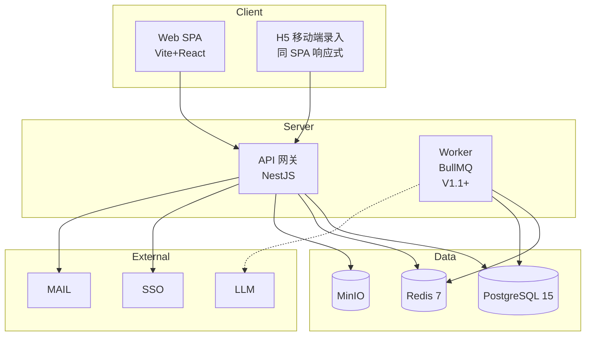

# 政策 One Piece · 技术架构文档 (TECH-ARCH)

> **本文档目的**:把 PRD 11 章 + K 模块的"做什么"翻译成"怎么做"。
>
> **基调**:小团队工具 / 最小复杂度 / 反 CRM / 单人 + AI。延续一期原型栈,不求"企业级标配",求"跑得起来、改得动"。
>
> **与 PRD 的关系**:PRD-user-led.md 是需求规格(What),本文是实现选型(How);PRD-comparison.md §6 的 4 处借鉴在本文中以"技术预留"形式兑现。
>
> **文档状态**:2026-04-24 草稿版 —— §1 前置选型多数标 ⚠️ 待公司 IT / 法务拍板,其余 AI 推理版,扫审后小改即可。

---

## 0. 编写约定

### 0.1 标注体系

| 标记 | 含义 | 处置 |
|---|---|---|
| ✅ | 已拍板 / 沿用一期原型 | 无需重决 |
| 🔷 | AI 推理默认值 | 用户可改 |
| ⚠️ | 待公司 IT / 法务拍板 | 必须外部确认,不能 AI 自拍 |
| ♻️ | 偷懒版,待回炉 | 推进阶段性完成后回来重做 |

### 0.2 本文不做什么

- **不选**:具体云厂商 SKU / 具体机房 / 具体 SSO 品牌版本 —— 依赖公司 IT 确认
- **不做**:代码模板 / 脚手架 / 详细目录树 —— 实现时由 AI 辅助生成
- **不重复**:PRD 已写清楚的业务规则 —— 本文引用章节号,不 copy
- **不卷**:不追求企业级 SRE / 不写 SLA / 不拍复杂微服务拆分

### 0.3 贯穿原则

1. **快速上手** > 完美架构:先跑起来再说
2. **成熟方案** > 新潮技术:TypeScript 全栈、PostgreSQL、NestJS 都是成熟选择
3. **反 CRM**:不堆模块、不上流程引擎、不做字段级权限(见 PRD §7.1.1)
4. **前端可独立跑** 的能力保留:一期 localStorage 模式作为 dev fallback,不拆掉

---

## 1. 前置选型决策(10 项)

> 前 4 项是核心架构、后 6 项对齐 PRD §8.4。**所有 ⚠️ 项实装前必须公司 IT / 法务拍**,本文仅给 AI 推理默认值供参考。

### 1.1 部署形态 ⚠️

| 候选 | 适用 | 成本(单人团队) |
|---|---|---|
| **私有云 / 公司机房 🔷** | 政府事务数据敏感 + 内网 SSO + 3 年留痕合规 | 中高(依赖公司 IT 现成平台) |
| 公有云(阿里云 / 腾讯云) | 无内网合规约束 / 需要弹性 | 低 |
| SaaS | 数据可外托 | 最低 |

**AI 推理**:🔷 **私有云 + Docker Compose 起步**(单机部署),V0.5 后如公司有 K8s/PaaS 再升级。合规优先。

**待确认**:公司是否有现成 K8s/容器平台;数据出域合规边界。

### 1.2 后端栈 🔷

**选**:**NestJS 10 + TypeScript + Node.js 20 LTS**

**理由**:
- 跟前端 TS 同语言,类型可在 `packages/shared-types` 共享,单人切换前后端成本低
- 装饰器 + 模块化对齐 PRD 第 3/4/5 章的模块划分,代码即文档
- 生态成熟,AI 辅助下产出稳定

**备选**:Express(更轻但结构性弱,权限矩阵落地会乱);FastAPI(Python 生态强但跨栈,不值);Spring Boot(太重,不匹配单人团队)。

### 1.3 数据库 + 缓存 + 对象存储 🔷

| 层 | 选型 | 版本 | 用途 |
|---|---|---|---|
| 主库 | **PostgreSQL** | 15+ | 业务数据,jsonb 支持 ParamTemplate / InterfaceTool schema |
| 地理(可选) | PostGIS | 3.3+ | 如果 F2 监管图层要做地理范围查询;MVP 可先不上 |
| 缓存 | **Redis** | 7+ | 会话 / 级联匹配缓存 / 热力预计算 / BullMQ 队列 |
| 对象存储 | **MinIO** | 私有云 | 工具文档 / 导出 PDF / 语音文件;公有云则 OSS |

**备选**:MySQL(运维更熟但 jsonb 弱);MongoDB(强关系模型不合适,不考虑)。

**MVP 降级**:Redis 可先不上(QPS 低,PostgreSQL 单点足够);级联匹配改进程内缓存(LRU)。

### 1.4 LLM 网关 ⚠️

**MVP 不上**。F1(语音录入)/ F7(周月报生成)都是 V1.1+,届时再决。

**AI 推理默认**:🔷 **公司内部 LLM 网关优先**(政策 / 拜访内容敏感,不出公司);无则降级阿里云通义千问 API(国内合规)。避免直连 OpenAI。

**待确认**:公司是否有统一 LLM 网关;外部 LLM 调用的合规边界。

### 1.5 SSO 协议 ⚠️

| 候选 | 场景 | AI 倾向 |
|---|---|---|
| **OIDC 🔷** | 现代 IDaaS / Keycloak / Azure AD | ✅ 默认 |
| SAML 2.0 | 老牌 ADFS / CAS 迁移 | 备选 |
| 自建账号 | 公司无统一 IdP | MVP fallback,V0.5 前替换 |

**待确认**:公司 IdP 类型、协议版本、测试环境接入方式。

**MVP fallback**:内置账号 + JWT(复用一期假登录 6 角色),V0.5 前接入真 SSO。

### 1.6 地图底图 ⚠️

| 层 | 选型 |
|---|---|
| 行政边界(MVP)| ✅ **阿里 DataV GeoJSON 离线**(沿用一期,`public/geojson/`)|
| 在线瓦片(可选) | 🔷 **天地图**(官方 + 政务场景合规);备选高德 / 百度 |
| F2 监管图层叠加 | V1.1 评估,需要时选天地图或自建矢量瓦片 |

**MVP 不需要在线瓦片**,行政边界离线就够。

**待确认**:是否需要在线瓦片(底图视觉效果 vs 流量配额);F2 叠加要求。

### 1.7 邮件接入 ⚠️

**AI 推理**:🔷 **SMTP + 公司邮件系统**。MVP 前后端 mock(不发真邮件),V0.5 接入。

**待确认**:公司 SMTP 出口 / 反垃圾策略 / 发件人身份。

### 1.8 Mock 归属 ✅

- **一期 `src/mock/`** 保留,作为前端 dev fallback(无后端也能跑)
- **V0.5 后**:mock 数据拆成独立 JSON fixture,通过 env `VITE_USE_MOCK=true` 切换;不拆到独立 mock server

### 1.9 数据存储位置 ⚠️

跟 §1.1 部署形态强耦合。**私有云 → 公司机房**;公有云 → 国内区域(不出境)。

**待确认**:法务对"政府事务数据 + 关键人档案(K 模块)" 的存储位置合规要求。

### 1.10 日志落地 🔷

**AI 推理**:
- MVP:**pino 结构化日志** + 本地文件 rotate
- V0.5:接入公司统一日志平台(如果有)
- V1.0:如无公司平台,自建 **Loki + Grafana**(比 ELK 更轻,单人可维护)

**待确认**:公司是否有统一日志平台 / 告警通道。

### 1.末 前置选型总结表

| # | 项 | AI 默认 | 状态 |
|---|---|---|---|
| 1.1 | 部署形态 | 私有云 + Docker Compose | ⚠️ |
| 1.2 | 后端栈 | NestJS + TS | 🔷 |
| 1.3 | DB / 缓存 / 对象存储 | PostgreSQL + Redis + MinIO | 🔷 |
| 1.4 | LLM 网关 | 公司内部网关优先 | ⚠️ |
| 1.5 | SSO | OIDC;MVP 假登录 | ⚠️ |
| 1.6 | 地图底图 | DataV 离线(沿用) | ✅ / 天地图 ⚠️ |
| 1.7 | 邮件 | SMTP | ⚠️ |
| 1.8 | Mock | `src/mock/` 保留 + env 切换 | ✅ |
| 1.9 | 数据存储位置 | 跟 §1.1 绑定 | ⚠️ |
| 1.10 | 日志落地 | pino → Loki+Grafana | 🔷 |

---

## 2. 系统架构总图

### 2.1 C4 · Context(外部视角)

```mermaid
graph LR
  U1[属地 GA]
  U2[中台 GA]
  U3[负责人/PMO]
  U4[sys_admin]
  POP[POP 系统]
  SSO[公司 SSO/IdP]
  MAIL[公司邮件]
  LLM[LLM 网关<br/>V1.1+]
  POLICY[政策知识库<br/>F6 V1.1]
  REGION[行政区划 API<br/>MVP 种子]

  U1 --> POP
  U2 --> POP
  U3 --> POP
  U4 --> POP
  POP --> SSO
  POP --> MAIL
  POP -.V1.1+.-> LLM
  POP -.V1.1.-> POLICY
  POP --> REGION
```

### 2.2 C4 · Container(内部视角)



### 2.3 关键架构决策

| # | 决策 | 理由 |
|---|---|---|
| A1 | **前后端分离 SPA**,不用 SSR | 单人团队维护成本低 + 地图场景 SSR 意义小 |
| A2 | **REST API**,不用 GraphQL | PRD 模型稳定 + 单人团队 GraphQL schema 维护成本高 |
| A3 | **同一代码仓库,monorepo 不上 Turborepo** | npm workspaces 够用;Turborepo 单人收益小 |
| A4 | **Worker 进程 V1.1+ 才上** | MVP 同步处理够(无大批异步任务) |
| A5 | **MVP 单机部署** | 用户 < 50 / QPS < 10,不值得上集群 |

---

## 3. 前端架构

### 3.1 栈(延续一期 ✅)

| 层 | 选型 |
|---|---|
| 构建 | Vite 5 |
| 框架 | React 18 + TypeScript 5.6 |
| UI | Ant Design 5(暗色算法,青色主色 `#00d4ff`) |
| 图表 / 地图 | ECharts 5 + echarts-for-react |
| 状态(客户端) | Zustand 5 |
| 路由 | React Router 6 |

### 3.2 新增(二期必须)

| 层 | 选型 | 用途 |
|---|---|---|
| HTTP 客户端 | **axios** | 统一拦截器、错误处理、token 注入 |
| 服务端态 | **TanStack Query (react-query) v5** | 替代一期 localStorage / mockStore,缓存 + 重新验证 |
| 表单 | AntD Form(已有) | 不引入 react-hook-form,AntD 够用 |
| 校验(shared) | **Zod**(或 class-validator via DTO 共享) | 前后端同一套 schema |
| 错误上报 | **Sentry**(V0.5+) | 前端异常 + 性能 |

### 3.3 项目结构(基于现状扩展)

```
src/
├── api/                  [新增] 二期 HTTP 接口层,按模块分文件(auth.ts / visit.ts / pin.ts …)
├── components/           现有
│   ├── dialogs/
│   ├── header/
│   ├── map/              MapCanvas 核心
│   ├── panels/           StatsPanel / TopRankPanel
│   └── sidebar/
├── hooks/                [新增] 自定义 hooks(useAuth / usePermission / useMapDrill)
├── layouts/              现有
├── mock/                 现有,env 切换保留
├── pages/                现有
├── stores/               现有 5 个 → 按需增加
├── styles/
├── types/                与后端共享类型(从 packages/shared-types 引入)
└── utils/
```

### 3.4 关键实现点

| 点 | 方案 |
|---|---|
| **权限守卫** | 路由级:`<PermissionRoute allow="pmo,lead">`;组件级:`<PermissionGate>`;调用后端权限元数据(PRD §5.1) |
| **地图下钻** | 延续一期 MapCanvas;市/区 GeoJSON 懒加载(点击省份才 fetch) |
| **H5 录入**(PRD B15) | 响应式 + `@media` 断点;不单独建子应用 |
| **热力色彩公式** | 前端计算(P50/P80 相对百分位),对齐 PRD §6.5;参数可后端配置 |
| **图钉留言实时** | MVP 轮询 5s;V1.0 评估 WebSocket |
| **导出水印** | 前端 SVG overlay(PRD §7.1.1);服务端导出 PPT 时 pptx 库注入 |

---

## 4. 后端架构

### 4.1 栈

| 层 | 选型 |
|---|---|
| 运行时 | Node.js 20 LTS |
| 框架 | NestJS 10 |
| ORM | **TypeORM 0.3+**(NestJS 生态默认);备选 Prisma(DX 更好但 NestJS 集成稍弱) |
| 校验 | class-validator + class-transformer |
| 认证 | passport-jwt + passport-oidc |
| 授权 | **CASL 6**(基于 ability,与 PRD §5 权限矩阵对齐) |
| 任务队列(V1.1+) | BullMQ(基于 Redis) |
| 日志 | pino + nestjs-pino |

### 4.2 模块划分(对齐 PRD 第 3/4 章)

```
apps/api/src/
├── common/              拦截器 / 过滤器 / 装饰器 / 守卫
├── auth/                SSO 登录 + JWT
├── users/               User / Role / UserRole
├── regions/             行政区划(种子数据)
├── visits/              Visit + ParamTemplate 校验
├── pins/                Pin + Comment + PlanPoint(父子关系)
├── policies/            PolicyTheme + CoverageItem(级联匹配算法 PRD §4.5.6)
├── tools/               Tool + DocumentTool + InterfaceTool + ToolBinding + ConsumptionLog
├── gov/                 GovOrg + GovContact(K 模块)
├── exports/             ExportRecord + 水印注入
├── audit/               AuditLog(MVP sys_admin 读)
├── notifications/       邮件 / 站内消息(MVP 只有邮件)
└── main.ts
```

### 4.3 API 风格

- **REST**,版本前缀 `/api/v1`
- 资源化命名,对齐 PRD 第 4 章实体:`/visits` `/pins` `/policy-themes` `/tools` `/gov-orgs` …
- 分页:**cursor + limit**(不是 page + size,避免深翻页)
- 响应结构:`{ data, meta }` / 错误 `{ code, message, details }`
- 错误码:业务码 `E_xxxx`,HTTP 状态分层(4xx 业务 / 5xx 系统)

### 4.4 认证授权链路

```
用户 → SSO(OIDC) → 后端验证 → issue JWT (15min) + refresh token (7d in Redis)
                                ↓
       请求带 JWT → 守卫验证 → CASL ability 检查 → 控制器 → 审计切面
```

**关键点**:
- **无地域硬隔离**(PRD §1.3):CASL 规则不按 region 过滤,而按"主责属主 / 参与方 / 显式分享"
- **sys_admin 覆盖**(PRD §5.4):超级权限走单独守卫,所有操作写 AuditLog
- **Export 水印**(PRD §7.1.1):ExportRecord 切面,每次导出留痕 3 年

### 4.5 权限执行引擎(对齐 PRD §5)

```typescript
// 伪代码:基于 CASL 的 ability 定义
defineAbilitiesFor(user: User) {
  const { can, cannot, build } = new AbilityBuilder(createMongoAbility);

  if (user.role === 'local_ga') {
    can('read', 'Visit');                          // 全读基线
    can(['create', 'update'], 'Visit', { owner_id: user.id });
    can(['create', 'update'], 'Visit', { participants: { $in: [user.id] } });
    // … 对齐 PRD 5.1.2 属地组
  }
  if (user.role === 'hq_ga') {
    can('manage', ['Tool', 'PolicyTheme']);        // 中台 GA
  }
  // … lead / pmo / sys_admin
  return build();
}
```

### 4.6 关键算法(引用 PRD 不重复)

- **级联匹配**:PRD §4.5.6 —— 工具 → 地域 → 政策主题三级匹配,Service 层实现,结果缓存 Redis 1h
- **热力聚合**:60 天窗口 + P50/P80 相对百分位(PRD §6.5)—— 定时任务每天 02:00 预计算,缓存 Redis 24h
- **蓝点转色**:PlanPoint 状态机(PRD §4.3.4)—— Service 层状态流转 + Comment 自动发言

---

## 5. 数据层

### 5.1 Schema 映射 PRD 第 4 章

| PRD 实体 | 表名 | 关键列 |
|---|---|---|
| User | users | id (uuid v7), role, region_default |
| Role | roles | code (enum), name |
| UserRole | user_roles | user_id, role_id(多对多) |
| Region | regions | code(国标), level, parent_code, centroid(PostGIS 或 lat/lng) |
| Pin | pins | id, region_code, status, lead_user_id, created_at |
| Comment | comments | id, pin_id, author_id, kind(manual/system), body |
| PlanPoint | plan_points | id, pin_id(nullable), region_code, status, planned_at |
| Visit | visits | id, region_code, owner_id, contact_id(K), contact_person, department, color, content |
| PolicyTheme | policy_themes | id, name, status, coverage_source |
| ParamTemplate | param_templates | id, theme_id, schema(jsonb) |
| CoverageItem | coverage_items | id, theme_id, region_code, score, source |
| Tool | tools | id, kind(document/interface), name, owner |
| DocumentTool | document_tools | tool_id, file_key(MinIO) |
| InterfaceTool | interface_tools | tool_id, endpoint, auth_schema(jsonb) |
| ToolBinding | tool_bindings | tool_id, theme_id / region_code / role(多态) |
| ToolConsumptionLog | tool_consumption_logs | id, tool_id, user_id, context |
| GovOrg | gov_orgs | id, name, level, region_code, parent_id |
| GovContact | gov_contacts | id, gov_org_id, name, position, status(active/离职) |
| AuditLog | audit_logs ♻️ | id, actor, action, target, payload(jsonb), created_at |
| ExportRecord | export_records ♻️ | id, exporter, content_hash, watermark_payload, created_at |

### 5.2 列类型约定

| 类型 | 规范 |
|---|---|
| 主键 | UUID v7(按时间排序 + 无碰撞,优于自增) |
| 时间戳 | `timestamptz`,应用层 UTC,展示层 `dayjs` 转本地 |
| 枚举 | PostgreSQL `enum` 类型;`status` 字段强类型 |
| JSON | `jsonb`(ParamTemplate.schema / InterfaceTool.auth_schema / ExportRecord.payload) |
| 软删 | `deleted_at timestamptz NULL`;查询默认过滤;3 年后物理删(PRD §7.2) |
| 地理 | MVP 用 `lat float, lng float`;如 F2 要空间查询升级 PostGIS `geometry(Point, 4326)` |

### 5.3 Redis 用法

| Key 模式 | 用途 | TTL |
|---|---|---|
| `session:{token}` | 登录会话 | 8h |
| `refresh:{user_id}:{jti}` | Refresh token | 7d |
| `coverage:{theme_id}:{region}` | 级联匹配缓存 | 1h |
| `heat:{mode}:{yyyy-mm-dd}` | 热力预计算 | 24h |
| `bull:*` | BullMQ 队列(V1.1+) | - |

### 5.4 MinIO 路径约定

```
/pop/
  documents/{tool_id}/{filename}          工具附件
  exports/{user_id}/{yyyy-mm}/{file}      导出文件(水印已嵌入)
  attachments/visit/{visit_id}/{file}     拜访附件
  voice/{user_id}/{yyyy-mm-dd}/{file}     语音原文件(V1.1+)
```

### 5.5 迁移

- **TypeORM migration** 正向前进,不设计回滚(单人 + 小团队,错就改下一个 migration)
- 生产环境 migration 前必须备份
- 跨版本破坏性变更用蓝绿双版本部署(V0.5+ 再考虑)

---

## 6. 外部集成

对应 PRD 第 8 章。

| 系统 | 协议 | 阶段 | 实现点 |
|---|---|---|---|
| SSO(公司 IdP) | OIDC / SAML | V0.5 | `apps/api/src/auth/`;MVP 假登录 fallback |
| 地图底图 | GeoJSON 离线(MVP)/ 瓦片(P1) | MVP ✅ | `public/geojson/` 继续 |
| 行政区划 | 种子数据 JSON | MVP ✅ | `regions` 表 + `src/mock/regions.ts` |
| 邮件 | SMTP | V0.5 | `nodemailer`;MVP dry-run |
| LLM 网关 | HTTPS(内部) | V1.1+ | 抽象 `LLMGateway` 接口,可切换内部 / 阿里云 |
| 政策知识库(F6) | HTTP + JSON Schema | V1.1 | InterfaceTool 框架已在 PRD §4.5 定义,运行时调用 |
| 监管源(F2) | 未定 | V1.1 | F2 实装时决定 |

**抽象原则**:所有外部依赖走 `Gateway` 接口,测试时 mock,切换时换实现。

---

## 7. 部署与运维

### 7.1 容器化

```yaml
# docker-compose.yml(MVP)
services:
  nginx:     # 反代 + 静态前端
  api:       # NestJS
  postgres:  # 15+
  redis:     # 7+
  minio:     # 单节点
  # grafana + loki(V1.0 可选)
```

**构建**:多阶段 Dockerfile;前端 Nginx 镜像 < 50MB,后端 Node 镜像 < 200MB。

### 7.2 环境拆分

| 环境 | 用途 |
|---|---|
| local | 开发机 Docker Compose + seed data |
| staging | 试点用户用,V0.5 启用 |
| production | V1.0 启用 |

### 7.3 CI/CD

- **MVP**:GitHub Actions(如公司允许外网)或 GitLab CI(内网);自动 lint + typecheck + 单测 + 构建镜像
- 部署:MVP 手动 `docker compose pull && up -d`;V1.0 自动化

### 7.4 监控与告警

| 层 | 工具 |
|---|---|
| 前端 | Sentry(错误)+ web-vitals(首屏 3s 指标,PRD §7.2) |
| 后端 | pino 日志 + Prometheus 指标(可选) |
| 告警 | 5xx > 1% 邮件告警(PRD §7.2);MVP 用 Grafana 或简单日志监控脚本 |

### 7.5 备份与灾备

- PostgreSQL:每日 `pg_dump` + 30 天滚动;归档到 MinIO
- MinIO:存储桶版本化 + 跨区同步(公有云)/ 本地 rsync(私有云)
- RTO 4h / RPO 1d,对齐 PRD §7.2

---

## 8. 安全

### 8.1 认证

- JWT:RS256,私钥存 `apps/api/keys/`(不入 git),密钥轮换 90 天
- Refresh token:Redis 存,登出时删除
- 登录限制:3 次错误锁 15 分钟;MVP 默认值,可配

### 8.2 授权

- CASL ability 按 PRD §5 权限矩阵生成
- 守卫:`@UseGuards(JwtAuthGuard, AbilityGuard)` + `@CheckAbility(...)` 装饰器
- **无字段级权限**(PRD §7.1.1 拍板),敏感信息通过"能看到的角色本身就是受信"控制

### 8.3 审计

- **AuditLog 切面**:拦截所有 `POST/PUT/PATCH/DELETE`,写 `audit_logs`
- MVP:仅 sys_admin 可读(PRD §5.末 H1 + §7.1.2)
- 留存 3 年(PRD §7.2)

### 8.4 导出水印

- 水印内容:`{导出人} · {导出时间} · POP · 仅供内部`
- 前端:SVG overlay(展示态)
- 服务端:导出 PPT / PDF 时 **必须嵌入**,`pptxgenjs` / `pdf-lib` 支持
- **ExportRecord 写盘**:每次导出写记录,payload 包含水印内容哈希(PRD §7.1.1 + §5.1.1)

### 8.5 传输与存储

| 环节 | 措施 |
|---|---|
| 传输 | HTTPS(TLS 1.2+),HSTS |
| 存储(敏感字段) | K 模块 `gov_contact.phone/email` 应用层 AES-GCM,密钥 KMS 托管(⚠️ 合规确认) |
| 密码 | MVP 假登录无密码;真 SSO 后无密码落地 |

---

## 9. 开发工程节奏

对齐 PRD 第 9 章分期,每期给具体工程任务。

### 9.1 V0.1 内测(4 周)

**目标**:录入闭环跑通,真后端 + 假 SSO

| 周 | 任务 |
|---|---|
| W1 | Monorepo 骨架(npm workspaces)+ NestJS 项目 + PostgreSQL schema + TypeORM migration |
| W2 | Auth 假登录 + User/Role + 基础 CRUD(Visit/Pin/PlanPoint)+ 前端 axios 层替换 localStorage |
| W3 | PolicyTheme + CoverageItem + 级联匹配算法 + 地图 API 接真后端 |
| W4 | Comment + 前后端联调 + seed data + 内测部署(docker-compose) |

### 9.2 V0.5 试点(8 周)

**目标**:真 SSO + 真权限 + 工具体系 + K 模块

| 内容 | 周数 |
|---|---|
| SSO OIDC 接入 + JWT + Refresh | 1-2 |
| CASL 权限矩阵落地(对齐 PRD §5 全量) | 2-3 |
| Tool 四件套(Document/Interface/Binding/ConsumptionLog)+ MinIO | 2-3 |
| **K 模块**(GovOrg + GovContact + Visit 双轨关联) | 2 |
| 邮件接入 + 计划蓝点 → 邮件推送闭环 | 1 |
| 试点部署 + 监控接入(Sentry + pino) | 1 |

### 9.3 V1.0 GA(8 周)

**目标**:sys_admin + 审计 + 导出水印 + H/I/J 模块

| 内容 | 周数 |
|---|---|
| AuditLog 切面 + sys_admin 后台 | 2 |
| ExportRecord + 导出水印(PPT/PDF/图片) | 2 |
| H/I/J 模块(拓展清单 / 工作台 / 历史)—— PRD 偷懒版回炉后做 | 3 |
| 性能调优 + 灾备演练 + GA 发布 | 1 |

### 9.4 V1.x+ 远期

按 PRD §9.3 的 F 池节奏推进(F2 广义异动 / F6 政策知识库真接入 / F7 月报增强 / F1 语音 / F13 Campaign 跨区域战役 …)。

### 9.5 代码规范

- **TypeScript strict mode**
- ESLint + Prettier,CI 阻断
- 提交规范:Conventional Commits(`feat: / fix: / docs: / refactor:`)
- **不写冗余注释**(只在 WHY 非显然时写)
- **不写未使用的测试骨架**,实写才写

---

## 10. 技术风险与未决项

### 10.1 技术风险(新增,对齐 PRD §9.4 之外)

| # | 风险 | 缓解 |
|---|---|---|
| TR1 | 单人全栈切换成本 | TypeScript 全栈抵消 + AI 辅助(Claude Code 场景) |
| TR2 | Prisma vs TypeORM 选型反悔成本 | MVP 先 TypeORM,schema 用 SQL 优先,ORM 层薄 |
| TR3 | PostGIS 学习曲线(如上) | MVP 不上 PostGIS,用 lat/lng float;F2 需要时再引 |
| TR4 | LLM 外部调用合规(V1.1+) | 抽象 Gateway,公司内部优先 |
| TR5 | MinIO 私有云单点故障 | V1.0 评估多节点 / 备份策略 |
| TR6 | Bundle 体积(ECharts + AntD 已重) | Vite lazy + AntD 按需引入 + dynamic import 地图模块 |

### 10.2 未决项登记

从 §1 结转 + 工程阶段新增。

| 来源 | 项 | 状态 |
|---|---|---|
| §1.1 / PRD §8.4 | 部署形态 | ⚠️ 公司 IT |
| §1.4 / PRD §8.4 | LLM 网关 | ⚠️ 公司 IT(V1.1 前) |
| §1.5 / PRD §8.4 | SSO 协议 | ⚠️ 公司 IT(V0.5 前) |
| §1.6 / PRD §8.4 | 地图底图在线瓦片 | ⚠️ 设计 / 产品 |
| §1.7 / PRD §8.4 | 邮件 SMTP | ⚠️ 公司 IT(V0.5 前) |
| §1.9 / PRD §8.4 | 数据存储位置 | ⚠️ 法务 |
| §1.10 / PRD §8.4 | 日志平台 | ⚠️ 公司运维 |
| §4.1 | ORM:TypeORM vs Prisma 最终拍 | 🔷 默认 TypeORM,V0.5 前不回头 |
| §7.3 | CI 平台:GH Actions vs GitLab CI | ⚠️ 公司网络策略 |
| §8.5 | K 模块敏感字段加密密钥托管 | ⚠️ 合规 |

---

## 末 · 兑现清单

### PRD-comparison.md §6 的 3 处剩余借鉴

| 借鉴 | 本文兑现点 |
|---|---|
| Campaign 跨区域战役(V1.0 后评估) | §5.1 预留 —— 不建表,V1.1 若激活再加 `campaigns` + 关联表 |
| F7 月报增强(V1.1) | §5.1 ExportRecord 模板字段可扩展;§4.2 `exports/` 模块为月报留接口 |
| F2 广义异动告警(V1.1 F2 落地时) | §10.1 TR3 预留 PostGIS 升级路径;§4.2 `notifications/` 模块可扩展告警 |

### 核心覆盖对照(本文 ↔ PRD)

| 本文章节 | 对齐 PRD |
|---|---|
| §1 前置选型 | PRD §8 外部依赖 / §8.4 未决项 |
| §2 系统架构 | PRD §6.1 信息架构(隐式承接)|
| §3 前端 | PRD 第 3 章 A/B/C 模块 + §6.5 色彩 |
| §4 后端 + §4.5 权限 | PRD 第 5 章权限矩阵 |
| §5 数据层 | PRD 第 4 章数据模型 + K 模块 |
| §6 外部集成 | PRD 第 8 章 |
| §7 部署运维 + §8 安全 | PRD 第 7 章非功能(7.1.1-7.1.6 + 7.2) |
| §9 工程节奏 | PRD 第 9 章分期 V0.1 / V0.5 / V1.0 |

### 文档状态

- **10 章均为偷懒版 ♻️**,标重点待公司 IT / 法务拍板后回炉
- **⚠️ 待公司确认 10 项**(§10.2 汇总),清单化处理,推进前必须外部拍板
- **PRD 偷懒章节(第 3 章 D-J / 第 4 章 4.6-4.7 / 第 5-9 章)** 回炉时,本文对应部分同步修订

---

**🚧 本文档完结状态**:2026-04-24 AI 推理草稿版产出;待用户扫审 + 小改 + 公司 IT / 法务拍板 ⚠️ 项后进入 V0.1 开发。
